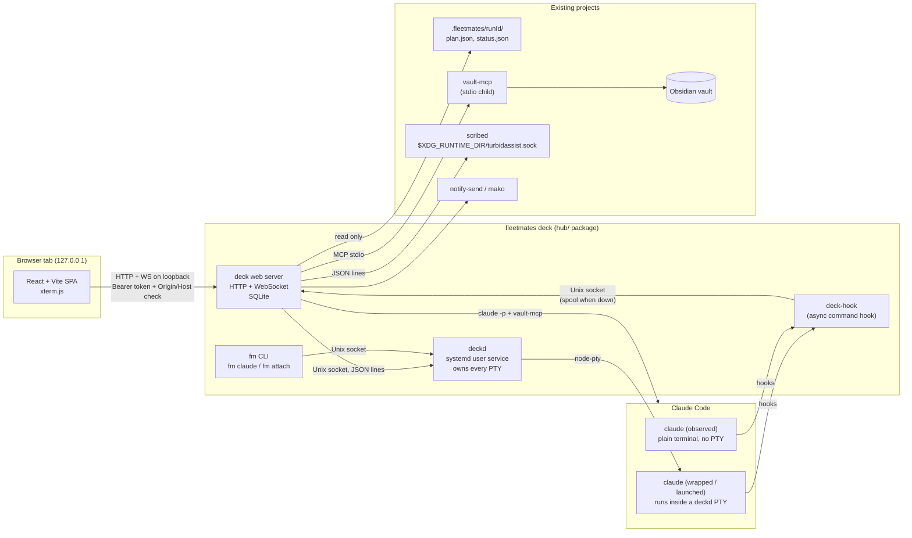

# 03 · Architecture

Status labels as in [02-domain.md](02-domain.md). The process split, the wrapper, hooks, token auth, localhost-only, SQLite and the stack are **Decided**. Paths, ports, file names and library picks are **Proposed** unless marked.

## 1. System context



## 2. Processes

### 2.1 deckd (Decided: a separate daemon owns PTYs)

Purpose: sessions survive a crash or restart of the web server, and of the browser.

- Runs as a systemd user service `fleetmates-deckd.service` (Proposed name), `Restart=on-failure`. Started at login.
- Owns every PTY for `wrapped` and `launched` sessions through `node-pty`. Spawns `claude` with the user's login environment plus `FLEETMATES_DECK_PTY=<ptyId>` so hook events can be tied to the PTY exactly (section 4.2).
- Keeps, per PTY:
  - a scrollback ring buffer (Proposed: 5,000 lines or 2 MiB, whichever is smaller);
  - a headless terminal model (`@xterm/headless`) used to read what is on screen: the permission prompt and its numbered options, the idle input box, the spinner region. This is the "screen signal" source (`S.*` events in [state-machines](interaction/state-machines.md));
  - the attached clients (terminal `fm` clients and the web server), and `lastInputFrom`.
- Input rule (Decided): any attached client may type; last keystroke wins; deckd stamps each input chunk with its source so the UI can show "Last typed from: terminal (kitty)".
- Resize rule (Proposed): the PTY follows the size of the client that typed most recently (state-machines SM-O12).
- Listens only on a Unix socket: `$XDG_RUNTIME_DIR/fleetmates-deck/deckd.sock`, directory mode 0700, socket 0600. Never on TCP (Decided: deckd is not reachable from a browser).
- deckd does not persist sessions across its own restart. If deckd dies, its PTYs die with it (child processes get SIGHUP). That is the accepted limit: deckd is small and changes rarely. `KillMode=process` is **not** used, so a systemd stop is a clean shutdown of all sessions; the web server shows them as `crashed · lost`.
- deckd has no knowledge of hooks, SQLite, vault or meetings. Keep it boring.

### 2.2 deck web server

- Runs as `fleetmates-deck.service` (systemd user, Proposed) and is also what `fleetmates ui` starts or opens (section 6).
- HTTP and WebSocket on `127.0.0.1:47800` by default (Proposed port, env `DECK_PORT`). Binds IPv4 loopback only; refuses to start on any other address in v1 (Decided: localhost only).
- Owns: the SQLite database, hook ingestion, the session state machines, requests and rules, notifications, the fleetmates run reader, the vault-mcp client, the scribed client, the Ask engine, research orchestration, and static serving of the built SPA.
- Connects to deckd as a client. If deckd is down it keeps serving history, vault and meetings, and shows the deckd banner (Failures board).
- Hook ingestion socket: `$XDG_RUNTIME_DIR/fleetmates-deck/hooks.sock` (0600). Hooks never talk HTTP, so they need no token and never touch the browser-facing port.

### 2.3 deck-hook (hook command)

- A tiny Node script installed by `fleetmates-deck init` (name pending Q1) as an **async** command hook for every event the deck uses (list in [04-integrations.md](04-integrations.md) section 2). Async hooks never block Claude Code (Decided intent: observation must never slow or alter a session).
- Reads the JSON payload from stdin, adds an envelope (receive time, `FLEETMATES_DECK_PTY` if set, parent pid chain for observed sessions, hook script version), writes one JSON line to `hooks.sock`, exits 0. Hard budget: 200 ms. On any failure it appends the line to a spool file `~/.local/state/fleetmates/deck/spool/hooks-<yyyymmdd>.jsonl` and exits 0. The web server drains the spool on start.
- Must never print to stdout (for `SessionStart` and `UserPromptSubmit`, stdout is added to Claude's context).

### 2.4 fm CLI

- `fm claude [claude args...]`: asks deckd to spawn `claude` with those args in the current directory and environment, then attaches the current terminal to the PTY (raw mode, resize forwarding). Exit behaviour (Proposed): closing the terminal detaches; the session keeps running in deckd and remains controllable from the browser. `Ctrl ]` then `d` detaches explicitly (like telnet escape), `fm attach <id>` reattaches.
- `fm ls`: list PTY sessions (id, repo, state, attached clients).
- `fm attach <id|repo>`: attach to an existing PTY.
- If deckd is not running, `fm claude` prints one line ("deckd is not running, starting plain claude; this session will be observed only") and execs plain `claude` so the user is never blocked. Whether unwrapped sessions may stay read-only and this fallback is acceptable is Q18 in [15-open-questions.md](15-open-questions.md) (default: yes to both).

### 2.5 Browser

A regular browser tab (Decided). No Chromium `--app` window, no Hyprland bind in v1. The SPA holds no durable state; everything comes from the server snapshot plus the event stream.

## 3. Repository and packaging layout (Proposed)

The fleetmates root stays the Claude Code plugin, zero dependencies, untouched (Decided: hub as a folder, root plugin untouched). `hub/` is its own npm package.

```
fleetmates/
  .claude-plugin/ scripts/ skills/ ...        # plugin, unchanged
  scripts/cli.mjs                             # gains `ui` and `deck` commands that forward to hub (section 6)
  docs/deck/                                  # this handoff
  hub/
    package.json                              # name: @andreymudri/fleetmates-deck (Open), own deps, bins
    bin/fm.mjs                                # fm claude | attach | ls
    bin/fleetmates-deck.mjs                   # start | open | init | status | doctor
    deckd/                                    # PTY daemon
    server/                                   # web server: http, ws, db, ingest, machines, adapters
      adapters/fleetmates.mjs                 # imports ../../scripts/state.mjs etc. (same repo)
      adapters/vault-mcp.mjs
      adapters/scribed.mjs
      adapters/notify.mjs
      ask/ research/ approvals/
    hook/deck-hook.mjs
    web/                                      # React + Vite SPA
      src/components/ src/screens/ src/state/ src/i18n/ src/styles/tokens.css
    systemd/fleetmates-deckd.service
    systemd/fleetmates-deck.service
    test/                                     # node:test for server/deckd, Playwright for web, fixtures
```

Constraints found in the fleetmates repo ([reference/fleetmates-contract.md](reference/fleetmates-contract.md)):

- Root `package.json` has **zero dependencies** as a hard rule, no `bin`, and a `files` whitelist that does not include `hub/`. The hub therefore publishes as its own package with its own `bin` entries; the plugin package is unchanged. This keeps the rename spec's "no `fleetmates` binary" decision intact for the plugin. **Open**: the owner wanted `fleetmates ui`; with this layout the literal commands are `fleetmates-deck` (hub bin) and `node scripts/cli.mjs ui` (plugin), unless the owner reverses the no-bin decision. See [15-open-questions.md](15-open-questions.md) Q1.
- Root tests glob is `tests/*.test.mjs` (not recursive). Hub tests live in `hub/test/` and run with the hub's own `npm test`; add a separate CI job.
- Root has no JSDoc checking (`checkJs: false`). The hub turns it on (`hub/jsconfig.json` with `checkJs: true`, `strict: true`) since JSDoc typing was a stated reason for JS over TS.
- Style follows the root: ESM `.mjs`, no semicolons, single quotes, 2-space indent.

Proposed hub dependencies (each needs a reason in the PR):

| Package | Why |
|---|---|
| `node-pty` | PTY ownership (native; the only native dep) |
| `@xterm/headless` | Screen model in deckd for prompt parsing |
| `ws` | WebSocket server (Node 24 ships only a client) |
| `@modelcontextprotocol/sdk` | Long-lived vault-mcp client over stdio |
| `react`, `react-dom`, `@xterm/xterm`, `@xterm/addon-fit`, `@xterm/addon-web-links` | UI |
| `d3-force` | Memory graph layout |
| `markdown-it` (with `html: false`) | Rendering notes and answers without raw HTML |
| `yaml` | Reading TurbidAssist `config.yaml` (tags, `session_dir`; [04-integrations.md](04-integrations.md) section 4) |
| `lucide-react` | Icons (design-system iconography) |
| dev: `vite`, `@vitejs/plugin-react`, `playwright` | Build and UI tests |

SQLite: Node 24's built-in `node:sqlite` (Proposed; avoids a second native dependency). It still prints an experimental warning on some 24.x builds; pin the Node minor in CI. Fallback: `better-sqlite3`.

HTTP: plain `node:http` with a small router (Proposed). The API surface is small ([05-api.md](05-api.md)) and a framework adds little.

## 4. Key flows

### 4.1 Launch from the UI (M2)

1. User submits the new-session form (repo, task). `POST /api/sessions`.
2. Web server checks the repo (Proposed rule: if the repo already has an active plain session, the response carries a warning and the UI offers "Run as a fleetmates job"; never blocks).
3. Web server asks deckd `spawn { cwd: repo, argv: ['claude'], env }`; deckd returns `ptyId`.
4. Web server creates the session row (`origin=launched`, `state=starting`), then types the task as the first prompt once the screen shows the idle input box (screen signal), not before.
5. `SessionStart` hook arrives with `FLEETMATES_DECK_PTY=ptyId`; the session gets its `claudeSessionId`.

Worktrees: the deck never creates one (Decided). A fleetmates run creates its own per-task worktrees.

### 4.2 Hook event to UI

1. `claude` fires a hook; deck-hook writes an envelope to `hooks.sock`.
2. Ingest resolves the deck session: by `FLEETMATES_DECK_PTY` first, then by `session_id` (current or alias), then by process key, else creates an `observed` session (`joinedMidLife` when the event is not `SessionStart`).
3. Events pass a 250 ms reorder buffer (Proposed) and feed the session and request machines.
4. Resulting changes are written to SQLite in one transaction with an `events` row carrying a monotonically increasing `seq`.
5. The server pushes the change to browsers over WebSocket (`session.upserted`, `request.opened`, `counts`...). Browsers that reconnect send their last `seq` and get the replay or a fresh snapshot ([05-api.md](05-api.md) section 3).

### 4.3 Answering a permission request from the browser (M3)

1. Browser `POST /api/requests/:id/answer { choice }`.
2. Server checks the tier rules ([07-approvals.md](07-approvals.md)): Destructive requires `confirm: true` and cannot be in a batch.
3. Server checks the screen currently shows that prompt (`screenMatch = on_screen`). If the user typed in the terminal in the last second, it refuses the answer with a message ("You are typing in the terminal. Answer there, or try again in a second."); it does not wait (typing guard, [state-machines](interaction/state-machines.md) 2.6 guard 2).
4. Server tells deckd to write the option's key (`1`, `2` or `3`, as printed by Claude Code) to the PTY with `source=browser`.
5. Server waits up to 3 s for the prompt to leave the screen or a matching `PostToolUse` / `PermissionDenied`; else `delivery=did_not_land` and the UI says so.

Observed sessions have no PTY: the drawer shows the request with "Answer in your terminal" and no buttons.

Alternative considered: Claude Code's `PermissionRequest` hook can return `allow` synchronously, which would let the deck approve even observed sessions. Rejected for v1: it can only allow (no deny), it would make a hook block on a human, and the owner chose keystrokes into the PTY. Revisit when designing M3 ([14-decisions.md](14-decisions.md) D-24).

### 4.4 Web server restart

deckd keeps running the PTYs. On start, the web server: opens SQLite, drains the hook spool, connects to deckd, calls `list` to get live PTYs and reconciles them with session rows (`alive`), re-reads fleetmates runs, reconnects vault-mcp and scribed, then accepts browsers. Sessions that ended while it was down become `ended` or `crashed · lost`.

## 5. Files and directories (Proposed)

| Purpose | Path | Mode |
|---|---|---|
| Config | `~/.config/fleetmates/deck/config.json`: boot and connection settings only (port, scan root, language, stale minutes, vault path, Obsidian vault name, TurbidAssist config path). UI behaviour prefs (notifications, rule suggestion threshold, motion, text size) live in the SQLite `prefs` table; Home density is per browser in `localStorage` `deck.density` ([06-storage.md](06-storage.md) section 8) | 0600 |
| Tier patterns | `~/.config/fleetmates/deck/tiers.json` (Decided path, from the Settings board) | 0600 |
| State dir | `~/.local/state/fleetmates/deck/` | 0700 |
| Database | `~/.local/state/fleetmates/deck/deck.db` (+ `-wal`) | 0600 |
| Browser token | `~/.local/state/fleetmates/deck/token` (Decided: random token in a 0600 file) | 0600 |
| Hook spool | `~/.local/state/fleetmates/deck/spool/` | 0700 |
| Logs | journald (both services); plus `~/.local/state/fleetmates/deck/logs/` for rotated debug logs when `DECK_DEBUG=1` | 0600 |
| Runtime sockets | `$XDG_RUNTIME_DIR/fleetmates-deck/{deckd,hooks}.sock` | dir 0700, sockets 0600 |
| Rules | `<repo>/.claude/settings.local.json` `permissions.allow` (Decided) | as found |
| Hooks | `~/.claude/settings.json` `hooks` (Decided: user level, installed once) | as found |

`DECK_LANG` (`en` | `pt`) is read from the environment first, then `config.json` (Decided: setting like `VAULT_LANG`).

## 6. Commands (Proposed; see Open Q1 in [15-open-questions.md](15-open-questions.md) on naming)

| Command | Does |
|---|---|
| `fleetmates-deck init` (alias `node scripts/cli.mjs deck init`) | Installs hooks into `~/.claude/settings.json` (merging, idempotent, backup first), installs and enables the two systemd user units, creates dirs and the token, runs the first-run checks in the terminal. |
| `fleetmates-deck open` (alias `node scripts/cli.mjs ui`) | Starts the web server unit if needed and opens `http://127.0.0.1:47800/#token=<token>` in the default browser with `xdg-open`. The SPA moves the token to `sessionStorage` and sends it as `Authorization: Bearer` on HTTP and as a WebSocket subprotocol ([08-security.md](08-security.md)). |
| `fleetmates-deck status` | Services, sockets, hook install state, versions. |
| `fleetmates-deck doctor` | Runs the same six checks as the First run screen and prints them. |
| `fleetmates-deck uninstall-hooks` | Removes only the deck's hook entries. |
| `fm claude`, `fm attach`, `fm ls` | Section 2.4. |

Full command list, including `uninstall`, `backup`, `restore`, `reset` and `report`, in [13-operations.md](13-operations.md).

Plugin-side (`scripts/cli.mjs`) additions, if kept: `ui` and `deck` commands must be added to the `REQUIRED` and `KNOWN_FLAGS` tables (a test scans for them), validate flags before doing anything long-running, and simply locate and exec the hub bin, printing install instructions when the hub is missing.

## 7. Performance budgets (Proposed)

| Budget | Target |
|---|---|
| Hook to UI (event visible in browser) | p95 under 300 ms |
| Keystroke echo browser to PTY and back | p95 under 50 ms on localhost |
| Home first paint from snapshot | under 500 ms with 20 sessions |
| Idle CPU, deckd + server, 10 sessions | under 2% of one core |
| fleetmates derive / liveness polling | every 60 s per active run, never per request |
| vault-mcp | one long-lived child; graph request under 500 ms at 1,000 notes |
