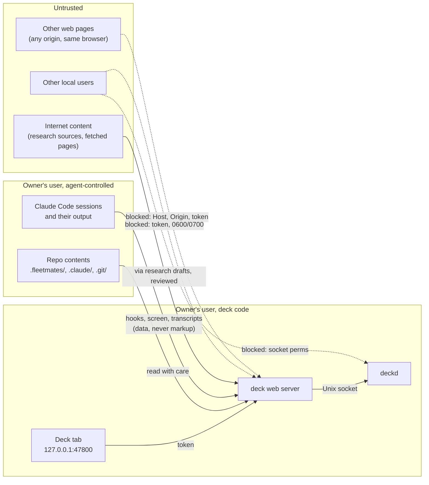

# 08 · Security and privacy

Status labels as in [02-domain.md](02-domain.md). **Decided** (D-31, D-34, D-35): localhost only; a random token in a 0600 file required on every HTTP request and WebSocket connection; requests with a wrong Host or Origin rejected; deckd not reachable from the browser; never innerHTML for agent, transcript or task text; Destructive gating. **Proposed**: everything else in this document, including how the token reaches the browser, the headers, the CSP value, the file and socket checks, redaction, confidential meeting handling details, the dependency policy and the checklists. No security constraint beyond these answers was given by the owner.

## 1. Scope

The deck is a single-user web app on one Linux machine (Omarchy). It can type into shells: deckd owns PTYs running Claude Code, and Claude Code can run any command the user approves. So the question is not "can an attacker read my dashboard" but "can anything other than the owner, sitting at the deck tab, cause keystrokes, launches, rule changes or file writes, or read what the deck can read".

In scope: web pages in the same browser, other local users, agent-written content rendered by the deck, repository content the deck reads, and the deck's own supply chain.

Out of scope, stated plainly so nobody relies on it: processes running as the owner's own user, including the supervised agents once they run code of their choosing (section 3.6), a compromised browser or desktop session, and root. This matches the fleetmates stance ("tamper-evident, not tamper-proof", fleetmates `SECURITY.md`).

## 2. Assets

| Asset | Where | Why it matters |
|---|---|---|
| PTYs that can run anything | deckd, `$XDG_RUNTIME_DIR/fleetmates-deck/deckd.sock` | Keystrokes into a PTY approve permission prompts and type shell input. This is the crown jewel. |
| Launch capability | web server `POST /api/sessions` | Starts `claude` in any repo under the scan root with a task the caller chooses |
| Browser token | `~/.local/state/fleetmates/deck/token` | Grants everything the UI can do |
| Approval rules | `<repo>/.claude/settings.local.json` | A rule makes Claude Code stop asking; a malicious rule is a silent, persistent grant |
| Tier patterns | `~/.config/fleetmates/deck/tiers.json` | Lowering a tier removes friction on dangerous commands |
| Claude Code hooks config | `~/.claude/settings.json` | The deck writes hooks there; a hook runs on every tool call of every session |
| Obsidian vault | `VAULT_PATH`, via vault-mcp | Personal knowledge; research saves write and commit to it |
| Meeting transcripts, asks, pins | scribed live stream; TurbidAssist `session_dir`; deck memory | Includes confidential client meetings: tags with `store_transcript: false` (example config: `client-a`, `client-b`) |
| Deck database | `~/.local/state/fleetmates/deck/deck.db` | Session history, request summaries (commands may contain secrets), ask threads, audit |
| Credentials in the environment | PTY env, scribed env (`HF_TOKEN`), Claude Code's own credentials | Leaking them through logs or UI |

## 3. Adversaries and threats

### 3.1 Trust boundaries



### 3.2 Threat table

| # | Adversary | Attack | Impact without controls | Controls (section) |
|---|---|---|---|---|
| T1 | Malicious web page | CSRF: form POST or `fetch` to `http://127.0.0.1:47800/api/...` | Approve a request, launch a session, add a rule | Bearer token not sent automatically (4.1); Origin check (4.2); no state-changing GET (4.2) |
| T2 | Malicious web page | DNS rebinding: `evil.example` resolves to 127.0.0.1, page reads API responses as same-origin | Read everything, then act | Host check (4.2); token (4.1) |
| T3 | Malicious web page | Cross-site WebSocket hijacking | Live control over the socket | Origin check at upgrade; token in the subprotocol (4.1, 4.2) |
| T4 | Malicious web page | Framing the deck (clickjacking) to trick an Allow click | Destructive approval by a disguised click | `frame-ancestors 'none'`, `X-Frame-Options: DENY` (4.4) |
| T5 | Page on another localhost port (a dev server running agent-written code) | Same-site by host (ports do not separate sites), so SameSite cookies would not stop it | CSRF with ambient credentials | No cookie credentials (4.1); exact Origin match including the port (4.2) |
| T6 | Other local user | Connect to the TCP port | Full control | Token (4.1); failed auth logged (4.10) |
| T7 | Other local user | Read the token file, database, sockets, logs | Full control, data exposure | 0600 files, 0700 dirs, checked at start (4.7) |
| T8 | Other local user | Squat the port while the deck is down, then receive the token when `fleetmates-deck open` runs | Token theft | Listener ownership check before opening the browser (4.1) |
| T9 | Other local user | Read the token from the browser's command line (`/proc/<pid>/cmdline`) while `xdg-open` passes the URL | Token theft | Accepted for v1 on a single-user desktop; SEC-O1 proposes a one-time launch code |
| T10 | Prompt-injected agent output | HTML or script in tool input, transcript, task title, note, meeting text rendered in the UI (XSS) | Script in the deck origin drives the whole deck | Text nodes only (4.5); markdown to React elements with `html: false` (4.5); CSP (4.4) |
| T11 | Prompt-injected agent output | Bidi controls (U+202E) or lookalikes to make a Destructive command read as harmless in an approval row | User approves the wrong thing | Visible control characters in command displays (4.5); tier from the classifier, never from agent prose ([07-approvals.md](07-approvals.md)) |
| T12 | Prompt-injected agent output | Links: `javascript:` URLs, OSC 8 terminal hyperlinks with spoofed text, remote images that exfiltrate data in the URL | Script, phishing, data leak | Link rules (4.6); CSP `img-src 'self' data:` |
| T13 | Prompt-injected agent output | Markup in desktop notifications (mako renders a markup subset) | Spoofed or clickable notification content | notify-send escaping (4.9) |
| T14 | Prompt-injected agent output | A "why" line that tells the user to approve | Social engineering | "why" shown as quoted agent text with a label; tier badge from the classifier (07) |
| T15 | Malicious repo content | `.claude/settings.local.json` or `.claude` is a symlink to another file | Deck rule write clobbers `~/.bashrc` or `~/.claude/settings.json` | lstat and regular-file checks before writes ([07-approvals.md](07-approvals.md) section 7.2) |
| T16 | Malicious repo content | `.git/config` with `core.fsmonitor`, `core.pager`, `diff.external`, textconv drivers, `core.hooksPath` | Code runs when the deck calls `git status` or `git diff`, outside any approval | Safe git invocation (4.8) |
| T17 | Malicious repo content | FIFO or symlink under `.fleetmates/`, crafted `status.json`, huge files | Hang, crash, spoofed UI text | `O_NONBLOCK` + `isFile()`, size caps, text-only rendering ([04-integrations.md](04-integrations.md) section 1.2) |
| T18 | Malicious repo content | `POST /api/open` with a path to a `.desktop` file or an executable | Code execution through `xdg-open` | Vetted open kinds only (4.9) |
| T19 | Internet content via research | Injected instructions in fetched pages steer the research team to write misleading or hostile notes | Poisoned vault | Draft, review, then save (Decided); sources listed with URLs; nothing written before approval |
| T20 | Supply chain | Malicious npm dependency or update, compromised GitHub Action, tampered native prebuild of `node-pty` | Code in the server, which can type into PTYs | Dependency policy (4.12) |
| T21 | Supervised agent (same user) | Reads the token, calls the API or writes to deckd.sock to approve its own requests | Self-approval | Limited: see 3.6 |
| T22 | Supervised agent (same user) | Sends forged hook envelopes to `hooks.sock` | Wrong pills, fake or closed requests | Cannot cause keystrokes: answers require deckd's screen match, not hook state; payload validation (4.11) |

### 3.3 Malicious web pages

The browser is the realistic attacker path: the owner browses the web in the same browser as the deck tab. Controls T1 to T5 must all hold independently; any one of them failing alone must not give control (defense in depth: token, Host, Origin, no CORS, no ambient credentials).

### 3.4 Other local users

Omarchy is a single-user desktop, but the controls cost little: loopback TCP is reachable by every local user, so the token is what protects the port; files and sockets rely on Unix permissions. T9 is the one accepted gap (SEC-O1).

### 3.5 Agent output and repo content

Every string that comes from an agent, a transcript, a task, a command, a file path, a note, a URL or a meeting is untrusted data, never markup (Decided: never innerHTML). This covers hook payloads, PTY screen text, fleetmates run files (agent-written, per the fleetmates contract), vault notes (research can put web content there), and meeting transcripts.

### 3.6 The supervised agent (limits)

An agent runs as the owner's user. Once it runs code it chose (a test it wrote, a build script, a package script) it can do anything the owner can, including reading the token file, writing to `deckd.sock` and typing "1" into any prompt. The deck cannot prevent that; same-user isolation would need a sandbox the deck does not have. What the deck does (Proposed):

- It never adds a new path from a capability that is not code execution to one that is. `GET` never changes state, so a fetch tool pointed at the deck cannot act. Reading the token, fetching from the deck port, touching the deck's sockets, state or config, and writing Claude Code settings or git hooks are classified Destructive by a floor that tiers.json cannot remove ([07-approvals.md](07-approvals.md) section 3.4). An agent that wants to approve itself has to ask the owner for exactly that, in red.
- Forged hook events (T22) can mislead the display but cannot trigger an answer: keys are only written when deckd's own screen model shows the matching prompt.
- The Safe tier is about intent and blast radius, not isolation: `cargo test` runs code the agent can edit. This is documented in the tier review ([07-approvals.md](07-approvals.md) section 12) and in the SECURITY.md section (section 6).

## 4. Controls

### 4.1 Token (Decided: random, 0600 file, every HTTP request and WebSocket; delivery Proposed)

- **Generation**: 32 bytes from `crypto.randomBytes`, base64url (43 characters). Written by `fleetmates-deck init` under umask 077 via temp file and rename to `~/.local/state/fleetmates/deck/token` (path per [03-architecture.md](03-architecture.md) section 5), mode 0600.
- **Delivery to the browser**: `fleetmates-deck open` (and `fleetmates ui`, name pending Q1 in [15-open-questions.md](15-open-questions.md)) opens `http://127.0.0.1:<port>/#token=<token>`. The fragment is never sent to the server and never appears in server or proxy logs. On load the SPA moves it to `sessionStorage` and calls `history.replaceState` to remove the fragment ([screens/rail-and-shell.md](screens/rail-and-shell.md) section 2). The fragment key is `token`, as in [03-architecture.md](03-architecture.md) section 6 and the shell spec.
- **Storage choice: `sessionStorage`, not a cookie** (Proposed). Reasons: a cookie is ambient authority, and SameSite does not separate ports on the same host, so any page on another localhost port is "same-site" (T5). A bearer token in `sessionStorage` is only sent by the deck's own code, which makes CSRF structurally impossible. An HttpOnly cookie would hide the token from XSS, but XSS in the deck origin can already drive every button, so that buys little. Cost: a new tab needs the token; tabs opened by the SPA with `window.open` inherit `sessionStorage`, and notification "Open" navigates the existing tab. When no deck tab is open, notification "Open" runs the same flow as `fleetmates-deck open` (listener check included): the server calls `xdg-open` with the fragment URL and a route hint, `#token=<token>&to=/s/<sessionId>`. The SPA accepts `to` only when it matches a known route pattern and removes the whole fragment with `history.replaceState`. A tab the user opens by hand without the fragment has no token and shows the "open the deck from its launcher" state (`token_invalid`, state-machines 4.1). This keeps the token on the browser's command line only when the deck launches it, the gap SEC-O1 would close (Proposed).
- **HTTP**: every `/api/*` request carries `Authorization: Bearer <token>`. The static SPA shell and assets are served without a token; they contain no data.
- **WebSocket**: browsers cannot set headers on a WebSocket, and query strings leak into logs, so the token travels as a subprotocol: `new WebSocket(url, ['deck.v1', 'deck.auth.' + token])`. The server validates it during the upgrade, answers with `Sec-WebSocket-Protocol: deck.v1` only, and rejects with HTTP 401 (the client maps it to `token_invalid`, state-machines 4.1). A socket whose token is rotated later is closed with code 4401.
- **Comparison**: `crypto.timingSafeEqual` on equal-length buffers; length mismatch fails without comparing.
- **Rotation**: `fleetmates-deck init` keeps an existing token, so open tabs stay valid ([13-operations.md](13-operations.md) section 2.3). `fleetmates-deck init --rotate-token` writes a new one; the web server picks it up and closes every open socket with 4401. There is no separate rotate command. The token is not rotated on server restart, because tabs are expected to survive a web server restart and reconnect (state-machines 4.1).
- **Listener check before opening** (T8): `fleetmates-deck open` verifies, before it passes the token to the browser, that the socket listening on `127.0.0.1:<port>` belongs to the owner's uid (the `uid` column of the matching LISTEN row in `/proc/net/tcp`) and that `GET /api/health` answers with the deck's instance id read from the state dir. If not: "Something else is listening on 127.0.0.1:47800. Not opening the deck." and exit 1.
- **Hooks and CLI** do not use HTTP. Hooks write to `hooks.sock` (0600 in a 0700 dir) without a token, as [03-architecture.md](03-architecture.md) section 2.2 says; a token adds nothing against the same user, who can read the token file anyway. [interaction/state-machines.md](interaction/state-machines.md) section 1.3 agrees.

### 4.2 Host, Origin and method checks (Decided: Host and Origin checks; details Proposed)

Applied to every request before routing:

| Check | Rule | Failure |
|---|---|---|
| Bind | `127.0.0.1` only; refuse to start on any other address in v1 (Decided localhost only) | exit with a message |
| Host | exactly `127.0.0.1:<port>`. `localhost:<port>` gets a 421 page "Open the deck at http://127.0.0.1:<port>" (one origin keeps `sessionStorage` and the Origin rule simple) | 421 |
| Origin on WebSocket upgrade | present and exactly `http://127.0.0.1:<port>` | 403, client state `origin_rejected` (close 4403) |
| Origin on non-GET `/api/*` | present and exactly `http://127.0.0.1:<port>`; missing Origin is rejected (the deck's own `fetch` always sends it) | 403 |
| `Sec-Fetch-Site` when present | `same-origin` or `none` for `/api/*` | 403 |
| Method semantics | `GET` and `HEAD` never change state anywhere in the API ([05-api.md](05-api.md)) | n/a |
| CORS | no `Access-Control-Allow-*` header ever; `OPTIONS` answers 403 | 403 |
| Body | `Content-Type: application/json` required on writes; size cap 256 KiB (terminal input and pastes travel over the WebSocket, not this API) | 415, 413 |

Authorization failures get a JSON body with no detail beyond the code, and a counter (4.10).

### 4.3 deckd isolation (Decided: not reachable from the browser)

- deckd listens only on `$XDG_RUNTIME_DIR/fleetmates-deck/deckd.sock`, never on TCP ([03-architecture.md](03-architecture.md) section 2.1). Linux enforces the socket file's permissions on `connect`, so 0600 on the socket and 0700 on the directory restrict it to the owner.
- Startup checks (Proposed): `$XDG_RUNTIME_DIR` is set, owned by the owner's uid and not group or world accessible; the `fleetmates-deck` directory is created with 0700 or, if it exists, has exactly that mode and owner; stale socket files are removed only after a failed `connect`. Any failure stops deckd with a message naming the path.
- deckd accepts only its JSON-lines protocol, caps a message at 1 MiB, and refuses a key write without `expectPrompt` for approval keys ([07-approvals.md](07-approvals.md) section 5.1).

### 4.4 HTTP response headers and CSP (Proposed)

Every response:

```
Content-Security-Policy: default-src 'none'; script-src 'self'; style-src 'self' 'unsafe-inline'; img-src 'self' data:; font-src 'self'; connect-src 'self' ws://127.0.0.1:<port>; media-src 'self'; manifest-src 'self'; frame-ancestors 'none'; frame-src 'none'; object-src 'none'; base-uri 'none'; form-action 'none'
X-Content-Type-Options: nosniff
X-Frame-Options: DENY
Referrer-Policy: no-referrer
Cross-Origin-Opener-Policy: same-origin
Cross-Origin-Resource-Policy: same-origin
Permissions-Policy: camera=(), microphone=(), geolocation=(), usb=(), serial=(), hid=(), payment=()
```

`/api/*` responses add `Cache-Control: no-store`.

- `<port>` is the configured port, substituted at start.
- `script-src 'self'`: no inline scripts, no `eval`. The Vite production build emits external module scripts only; `index.html` must not carry an inline bootstrap.
- `style-src 'unsafe-inline'` is there because xterm.js's DOM renderer injects `<style>` elements at runtime. The M0 spike checks whether the chosen xterm renderer works with `style-src 'self'`; if it does, drop `'unsafe-inline'` (SEC-O2). Style injection is far less dangerous than script injection, and all untrusted text is rendered as text anyway.
- `img-src 'self' data:` blocks remote images (T12). `connect-src` lists the WebSocket origin explicitly because older engines do not map `'self'` to `ws:`.
- Fonts are self-hosted (Geist, Geist Mono; [qa/qa-checklist.md](qa/qa-checklist.md)); no CDN, no Google Fonts.
- Trusted Types (`require-trusted-types-for 'script'`) is a later hardening once the build is checked against it (SEC-O3).
- Development: the Vite dev server binds `127.0.0.1` with `strictPort`, keeps its default host allowlist, proxies `/api` and the WebSocket to the real server, and is never used to serve a daily-driver deck.

### 4.5 Rendering untrusted text (Decided: never innerHTML; mechanics Proposed)

- Agent, transcript, task, command, path, note, URL and meeting strings render as React text nodes ([design/components.md](design/components.md) conventions). `dangerouslySetInnerHTML` is banned by ESLint `react/no-danger` with no exceptions ([qa/qa-checklist.md](qa/qa-checklist.md) section 1.7 agrees; see next point for markdown).
- **Markdown** (vault notes, Ask answers, research drafts, meeting summaries): `markdown-it` with `html: false`, `linkify: false`, `typographer: false`, and its default `validateLink`. The token stream is walked into React elements by the deck's own renderer; markdown-it's HTML output string is never used. Unknown token types render as their text. Wikilinks `[[note]]` become in-app note chips, not URLs. Images render as a link chip "image: {alt}" to the URL, never as `` for remote URLs.
- **Command, path and URL displays** (request rows, cards, notifications, audit): C0 and C1 controls, bidi and format characters (`\p{Cf}`, U+202A to U+202E, U+2066 to U+2069, U+200E, U+200F, U+061C) and default-ignorables are shown as visible tokens such as `<U+202E>`, the same idea as fleetmates' private `shown()` helper. fleetmates' exported `printable()` is not enough for the web: it is terminal escaping, not HTML escaping, and it passes bidi controls ([reference/fleetmates-contract.md](reference/fleetmates-contract.md)). Long commands scroll, never truncate, in approval rows ([screens/needs-you-drawer.md](screens/needs-you-drawer.md)).
- **Terminal text** is rendered by xterm.js, which interprets escape sequences but never as HTML. The deck does not enable clipboard writes from the PTY (no OSC 52 handler), and it never copies terminal title sequences into `document.title` except as sanitized text.
- **Paste into a PTY**: bracketed paste; the end sequence `ESC [ 201 ~` and other controls except tab and newline are stripped from pasted text; pastes over 4 KB ask first (state-machines 3.5).

### 4.6 Links (Proposed)

| Link source | Allowed schemes | Behaviour |
|---|---|---|
| Markdown links, citations, research sources | `http:`, `https:`; `obsidian:` only when built by the deck | `target="_blank" rel="noopener noreferrer"`; the full URL is shown in the source list and in a `title`; when the visible text is itself a URL that differs from the href, the href is shown instead |
| Terminal links (xterm web-links addon, OSC 8) | `http:`, `https:` | non-localhost links ask first, showing the real URL ([qa/qa-checklist.md](qa/qa-checklist.md) section 1.7); localhost links open directly (the deck API has no state-changing GET) |
| Anything else (`javascript:`, `data:`, `file:`, `vbscript:`, custom schemes) | none | rendered as plain text |

External links are opened by the browser, never by the server.

### 4.7 Files, directories and sockets (Proposed; token mode Decided)

| Path | Mode | Checked at start |
|---|---|---|
| `~/.config/fleetmates/deck/` and `config.json`, `tiers.json` | dir 0700, files 0600 | yes: owner uid, no group or other bits |
| `~/.local/state/fleetmates/deck/` (db, token, spool, backups, logs) | dir 0700, files 0600 | yes |
| `$XDG_RUNTIME_DIR/fleetmates-deck/` and its sockets | dir 0700, sockets 0600 | yes |

On a failed check the service refuses to start and prints the fix: "~/.local/state/fleetmates/deck/token is readable by other users. Run: chmod 600 …". Both services run with `UMask=0077` in their systemd units. SQLite files (`deck.db`, `-wal`, `-shm`) are created under that umask.

### 4.8 git and child processes (Proposed)

The deck runs git read-only commands in repos an agent can modify (branch, changed files, diff, counts for the confirm label). Every git call goes through one helper that adds:

```
git -c core.fsmonitor=false -c core.hooksPath=/dev/null -c core.pager=cat \
    -c diff.external= -c core.sshCommand=false -c protocol.allow=never \
    --no-pager <command> --no-ext-diff --no-textconv ...
env: GIT_TERMINAL_PROMPT=0, GIT_OPTIONAL_LOCKS=0, GIT_CONFIG_NOSYSTEM=1, GIT_ASKPASS=/bin/false
```

(`--no-ext-diff` and `--no-textconv` only on commands that accept them.) The deck never fetches, so network protocols are disabled. It imports fleetmates' `createGit` for run derivation ([04-integrations.md](04-integrations.md) section 1.2); whether that helper applies equivalent protections is not recorded in the fleetmates contract (SEC-O4). Until verified, the deck calls fleetmates derivation only for runs it discovered in repos under the scan root, on the slow timer.

All child processes (git, `notify-send`, `xdg-open`, `claude -p`, `scribed`, `pw-play`) are started with `execFile` or `spawn` and an argv array, never through a shell, with a timeout, and never with the deck token in their environment.

### 4.9 notify-send and `POST /api/open` (Proposed)

**notify-send** ([04-integrations.md](04-integrations.md) section 5):

- `spawn('notify-send', ['--app-name=fleetmates deck', '--urgency=normal', '--replace-id=<n>', '--action=open=Open', ...safeActions, '--', title, body])`. The `--` ends option parsing, so a repo named `--action=x` cannot become an option.
- Title and body: strip C0/C1 controls and bidi characters, then escape `&`, `<`, `>` (and `"`, `'`) because the notification body may be interpreted as markup by mako. Cap the title at 80 and the body at 200 characters.
- Action keys come from a fixed set (`open`, `allow`); the `allow` action exists only for Safe requests (Decided: never from a popup for Destructive). The chosen action returns on stdout and is mapped back to a request id held in server memory, never parsed from notification text.
- Notification bodies never contain meeting transcript text.

**`POST /api/open`** (used by "Open plan", "Open in Obsidian", "Open note in Obsidian", "Open log"): the API does not accept arbitrary paths or URLs. It accepts `{ kind, ref }`:

| `kind` | `ref` | Server resolves and checks | Opens with |
|---|---|---|---|
| `vaultNote` | vault-relative path | realpath inside `VAULT_PATH`, regular file, `.md` | `obsidian://open?vault=<name>&file=<encoded path>` |
| `meetingNote` | meeting id | note path from the deck's meeting row, then as `vaultNote` | same |
| `runPlan` | `{ repoId, runId }` | `plan.json` `planPath` resolved, realpath inside the repo scope, regular file, `.md` | `xdg-open <abs path>` |
| `postmeetLog` | meeting id | `<session_dir>/<id>/postmeet.log`, realpath inside `session_dir`, regular file | `xdg-open <abs path>` |

Refused always: symlinks that leave their root, non-regular files, files with any execute bit, `.desktop`, `.sh`, `.AppImage` and other extensions outside a small allowlist (`.md`, `.txt`, `.log`, `.json`). `xdg-open` gets one absolute path argument (it starts with `/`, so it cannot be read as an option) via `spawn` without a shell. External web URLs are never opened by the server (4.6).

### 4.10 Logs, redaction and telemetry (Proposed)

- **No telemetry.** The deck makes no outbound network request of its own: no update check, no analytics, no crash reporting, no CDN, no remote fonts. The only network traffic on the machine comes from Claude Code, the agents and research runs, which the owner already approves. This is stated in SECURITY.md (section 6).
- **What is logged** (journald, and `logs/` with `DECK_DEBUG=1`): event types, ids, timings, states, error codes. Never: full `tool_input`, prompts, transcript text, ask text, note bodies, the token, environment variables, `Authorization` headers.
- **Redaction** applied to every log line and to `summary` fields in the audit trail: URL userinfo (`scheme://user:pass@` becomes `scheme://***@`); `Authorization: Bearer …`, `Basic …`; `password|passwd|pwd|secret|token|api[_-]?key|access[_-]?key` followed by `=` or `:` and a value; known token shapes (`ghp_…`, `github_pat_…`, `sk-…`, `sk-ant-…`, `xox[bp]-…`, `AKIA…`, `hf_…`, JWT-shaped values (`eyJ` followed by two dot-separated base64url parts)); long base64 or hex runs over 40 characters in command arguments. The request row in the UI shows the command as the agent wrote it (the owner needs to see what they approve), but anything persisted beyond the 30-day detail window uses the redacted form.
- **Failed auth**: counted per remote address and logged once per minute with the count, so a local brute force is visible.

### 4.11 Input validation (Proposed)

- Hook envelopes: size cap 1 MiB, JSON only, validated against the pinned fixture schemas; failures go to `rejected_events` (state-machines 1.11 case 13) and are never applied.
- API bodies: schema-validated, unknown fields rejected; ids must match the ULID shape; repo ids must be under the scan root.
- SQLite: parameterized statements only; no string-built SQL.
- scribed messages: one JSON object per line, line cap 1 MiB, unknown types ignored and counted.

### 4.12 Confidential meetings (Proposed; rule from [04-integrations.md](04-integrations.md) section 4.2)

A meeting is confidential when its tag's `store_transcript` is `false` in TurbidAssist's `config.yaml` (02-domain `Meeting.confidential`). For those meetings:

| Data | Rule |
|---|---|
| Live transcript lines | memory only, in the server process and the open tab; WebSocket messages carry `ephemeral: true`; the client never writes them to `sessionStorage`, IndexedDB or the Cache API |
| Live asks and answers | memory only in the deck; scribed decides what it stores itself |
| Pins | time only, no label (04-integrations 4.3) |
| SQLite, logs, search index, audit | metadata only: id, tag, times, duration, state, source app. No text. Verified by the QA check "inspect DB" ([qa/qa-checklist.md](qa/qa-checklist.md)) |
| Desktop notifications | never contain meeting text for any tag |
| Summary after the meeting | read from the vault note `postmeet` wrote (TurbidAssist already omits the transcript for these tags) |
| Transcript search | confidential meetings are excluded from the deck's transcript search |

The tag list is re-read when `config.yaml` changes; a meeting's confidentiality is fixed at start from the tag it was started with. If the deck cannot read `config.yaml`, every meeting is treated as confidential (fail closed).

### 4.13 Destructive gating (Decided)

Summarized from [07-approvals.md](07-approvals.md): never batched, never a rule, never from a popup, no keyboard shortcut, always behind a confirm checkbox, and enforced by the server as well as the UI. Rule writes refuse Destructive patterns and prefixes that reach them.

### 4.14 Dependency policy (Proposed)

- The fleetmates root package keeps zero dependencies (Decided in fleetmates). All deck dependencies live in `hub/package.json`, each with a reason in the PR that adds it ([03-architecture.md](03-architecture.md) section 3).
- Exact versions, committed `package-lock.json`, `npm ci` in CI.
- Install scripts: CI and the release build run `npm ci --ignore-scripts`, then rebuild only the allowlisted native module (`node-pty`) explicitly. A new dependency with an install script needs an explicit note in its PR.
- Prefer packages with no transitive dependencies; `npm ls --all` diff is part of the PR review for dependency changes.
- `npm audit --omit=dev` runs in CI; high and critical findings in runtime dependencies block a release.
- Automated update PRs (Dependabot or Renovate) weekly, never auto-merged.
- GitHub Actions pinned by commit SHA; workflows get `permissions: contents: read` unless a job needs more.
- The hub is published from CI with npm provenance (`npm publish --provenance`), not from a laptop.
- Runtime: Node 24+ pinned to a tested minor in CI ([03-architecture.md](03-architecture.md) section 3).

## 5. Checklists

### 5.1 PR review (every PR touching `hub/`)

- [ ] No `dangerouslySetInnerHTML`, `innerHTML`, `outerHTML`, `insertAdjacentHTML`, `document.write`, `eval`, `new Function` (ESLint passes).
- [ ] New UI text from agents, transcripts, tasks, notes, paths or URLs goes through a text node; commands and paths through the visible-control formatter.
- [ ] New API route: token required, Origin rule applied, no state change on GET, body schema, listed in [05-api.md](05-api.md).
- [ ] New child process: `spawn`/`execFile` with argv, no shell, timeout, git through the safe helper.
- [ ] New file write: under the deck's own dirs with 0600/0700, or a repo settings file through the 07 writer (lstat, backup, atomic, re-read).
- [ ] New approval surface: tier rules enforced on the server; Destructive has no shortcut and no popup path.
- [ ] Nothing logs prompts, tool input, transcript text, env or tokens; redaction applied to new log fields.
- [ ] Confidential meeting data does not reach SQLite, logs, notifications or client storage.
- [ ] No new outbound network request.
- [ ] New dependency: reason stated, install scripts checked, lockfile diff reviewed.
- [ ] Classification corpus updated when tiers.json defaults change.

### 5.2 Public M1 release

- [ ] Server binds 127.0.0.1 only and refuses other addresses.
- [ ] Token: generated 0600, required on HTTP and WebSocket, fragment removed from the URL, `init --rotate-token` works and plain `init` keeps the token, listener ownership check in `open`.
- [ ] Host, Origin, `Sec-Fetch-Site` and CORS checks covered by automated tests, including a DNS-rebinding style Host, a foreign Origin, a same-host different-port Origin, and a missing Origin.
- [ ] CSP and headers present on every response; the build loads with no CSP violations in the console.
- [ ] XSS fixture pass: the injection strings in [qa/qa-checklist.md](qa/qa-checklist.md) section 1.7 in every agent-sourced field render inert.
- [ ] File, directory and socket modes checked at start; systemd units set `UMask=0077`.
- [ ] git helper flags in place; a fixture repo with `core.fsmonitor` set to a marker command does not run it.
- [ ] `/api/open` refuses paths outside the allowlist (fixture: `.desktop` file, symlink out of the vault).
- [ ] Logs reviewed from a one-week daily-driver run: no tokens, prompts or transcript text.
- [ ] No outbound network from the deck (checked with the machine offline: the deck works fully except for agents).
- [ ] Dependency audit clean for runtime dependencies; Actions pinned; provenance on publish.
- [ ] SECURITY.md deck section merged (section 6).
- [ ] M1 answers nothing from the deck (requests are read-only until M3), so the approval controls are verified again at M3 with [07-approvals.md](07-approvals.md) section 13.

## 6. How the deck fits into fleetmates SECURITY.md

fleetmates has one `SECURITY.md` at the repo root covering the plugin (gate threat model, the one outbound request, what is worth reporting, how to report). The deck lives in `hub/` of the same repo, so it adds a section to the same file rather than a second policy (Proposed; SEC-O5). Reporting stays the same channel (GitHub security advisory). Proposed section outline:

1. **fleetmates deck: what it defends against.** Web pages in the same browser (CSRF, DNS rebinding, WebSocket hijacking, clickjacking), other local users, agent-written text rendered in the UI, repository content the deck reads.
2. **What it does not defend against.** Processes running as your user, including the agents it supervises once they run code; a compromised browser or desktop session; root. "Safe" is a risk label for approvals, not a sandbox.
3. **Outbound requests.** The deck makes none of its own. The plugin's single update check is unchanged.
4. **Data it stores.** Session history, request summaries, ask threads and the audit trail in a 0600 SQLite file under `~/.local/state/fleetmates/deck/`; confidential meeting text is never stored.
5. **What is worth reporting.** Any way for a web page or another local user to change state or read data; any path from agent, transcript, note or repo text to HTML or script in the deck; a way to approve a Destructive request without the checkbox, from a popup, in a batch or by shortcut; a rule write outside `<repo>/.claude/settings.local.json`; a deck git call that runs repo-configured code; confidential transcript text persisted anywhere.

## Open items

| ID | Question | Default until decided | Blocks milestone |
|---|---|---|---|
| SEC-O1 | Replace the token in the launch URL with a one-time launch code exchanged for the token, so the browser's command line (readable by other local users) does not carry the long-lived token | Token in the fragment (accepted for a single-user desktop) | none (hardening) |
| SEC-O2 | Can the chosen xterm.js renderer run under `style-src 'self'` without `'unsafe-inline'`? | Keep `'unsafe-inline'` for styles only | M1 |
| SEC-O3 | Enable Trusted Types (`require-trusted-types-for 'script'`) once the build is verified against it | Off | none |
| SEC-O4 | Does fleetmates' `createGit` disable repo-configured code (`core.fsmonitor`, hooks, pager, external diff)? Not recorded in the fleetmates contract | Deck's own git helper for all deck git calls; fleetmates derivation only on the slow timer | M1 |
| SEC-O5 | One root SECURITY.md with a deck section, or `hub/SECURITY.md` linked from the root | One file, deck section | M1 |
| APR-O1 | Design-oversight review of tiers before M3 ([07-approvals.md](07-approvals.md)) | See 07 | M3 |
