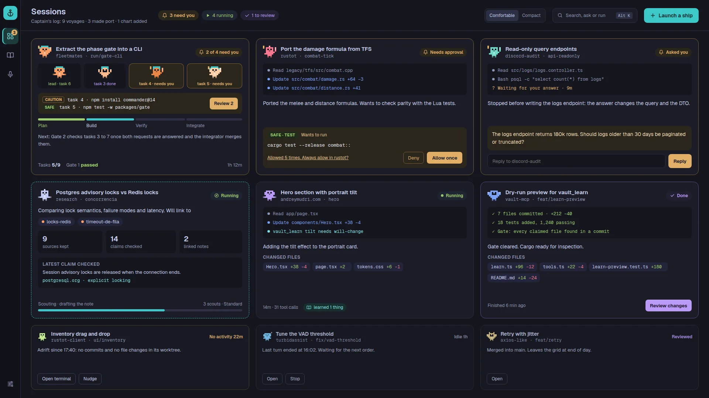

# Canvas renders

These are renders of the reviewed v1 design canvas (1920×1080, three critique passes, all findings fixed), taken on 2026-09-27. The canvas has 19 boards; 18 are rendered here. The 72×72 Crew component board is omitted, because its output is covered by the CrewSheet render. They are **design mockups, not screenshots of the built app**. Client names and paths use placeholders here (`client-a`, `Client A`, `/home/you`).

Where the canvas and the specs disagree, the specs win. The per-screen specs list every change from the canvas, and [../interaction/keyboard.md](../interaction/keyboard.md) overrides the canvas shortcuts.

| Board | Render | Spec |
|---|---|---|
| Home, busy, comfortable | [Home.webp](Home.webp) | [home.md](../screens/home.md) |
| Home, compact | [HomeCompact.webp](HomeCompact.webp) | [home.md](../screens/home.md) |
| Home, calm | [HomeCalm.webp](HomeCalm.webp) | [home.md](../screens/home.md) |
| Command palette | [Palette.webp](Palette.webp) | [palette.md](../screens/palette.md) |
| Needs-you drawer | [Approvals.webp](Approvals.webp) | [needs-you-drawer.md](../screens/needs-you-drawer.md) |
| Focus | [Focus.webp](Focus.webp) | [focus.md](../screens/focus.md) |
| Team run | [Team.webp](Team.webp) | [team-run.md](../screens/team-run.md) |
| Failures | [Failures.webp](Failures.webp) | [failures-and-loading.md](../screens/failures-and-loading.md) |
| Memory, clusters + ask | [MemoryV1.webp](MemoryV1.webp) | [memory.md](../screens/memory.md) |
| Memory, local graph + note | [MemoryNote.webp](MemoryNote.webp) | [memory.md](../screens/memory.md) |
| Research form | [ResearchForm.webp](ResearchForm.webp) | [research.md](../screens/research.md) |
| Research review | [ResearchReview.webp](ResearchReview.webp) | [research.md](../screens/research.md) |
| Meetings | [Meetings.webp](Meetings.webp) | [meetings.md](../screens/meetings.md) |
| Meeting live | [MeetingLive.webp](MeetingLive.webp) | [meetings.md](../screens/meetings.md) |
| Settings | [Settings.webp](Settings.webp) | [settings.md](../screens/settings.md) |
| First run | [FirstRun.webp](FirstRun.webp) | [first-run.md](../screens/first-run.md) |
| Crew sheet | [CrewSheet.webp](CrewSheet.webp) | [crew-sheet.md](../screens/crew-sheet.md), [crew.md](../design/crew.md) |
| Rail | [Rail.webp](Rail.webp) | [rail-and-shell.md](../screens/rail-and-shell.md) |

The screens below were never drawn and are specified in text only: New session ([new-session.md](../screens/new-session.md)), hover and animation states ([../design/design-system.md](../design/design-system.md) section 10), and every loading, empty and error variant beyond the Failures board.

