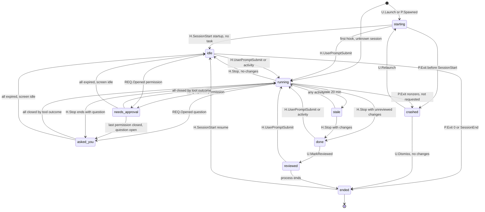
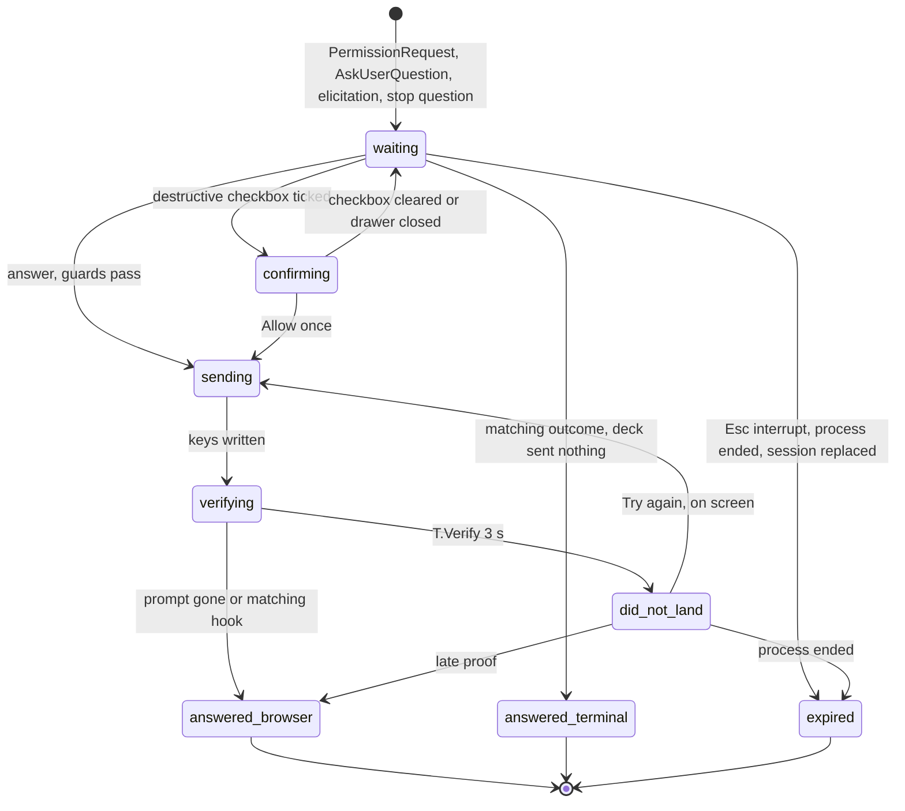
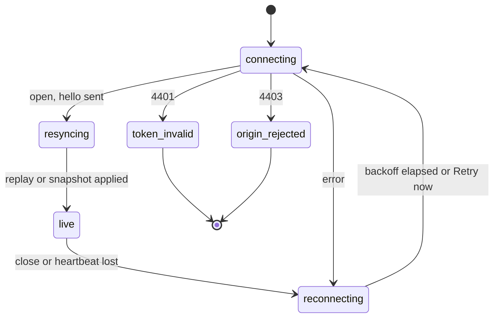
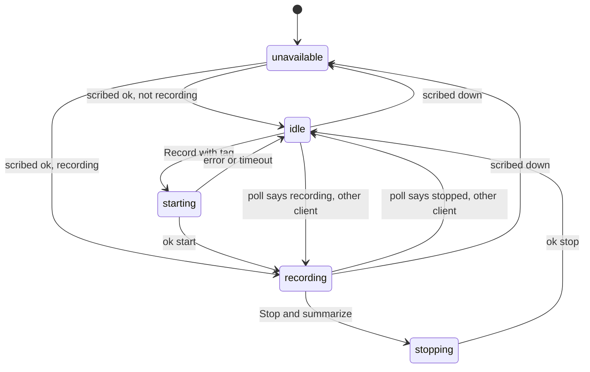
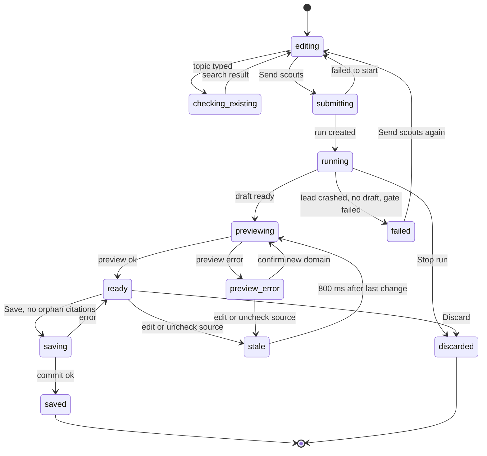
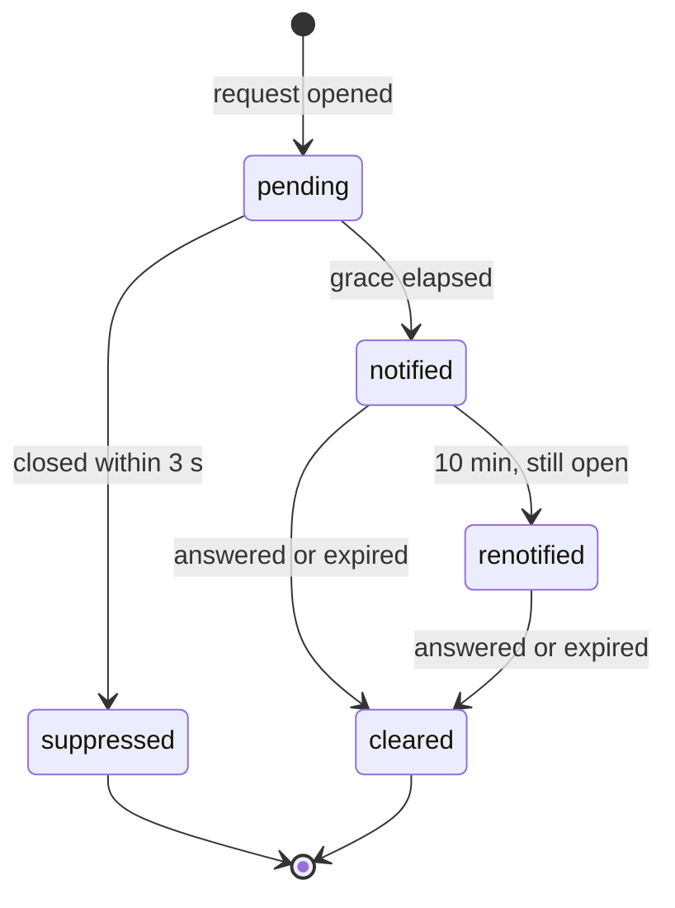
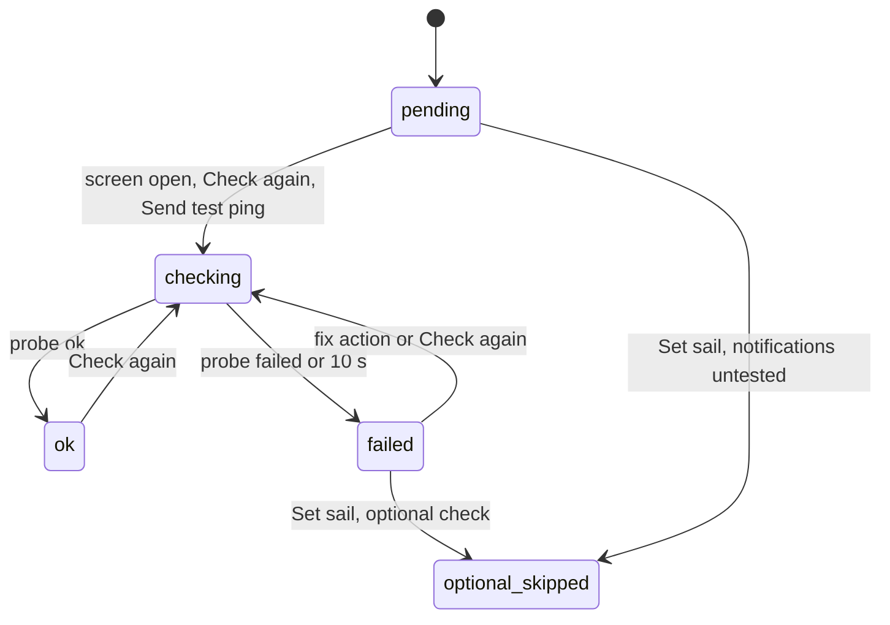

# Interaction state machines

This document turns the deck's behaviour into explicit finite state machines: states, events, guards, transitions, actions, timers and what the UI shows in each state. It follows the designer-skills `state-machine` method (list states, list events, define valid transitions, name impossible states, add guards, define entry and exit actions, map every state to UI) and uses `error-handling-ux`, `loading-states` and `feedback-patterns` for the error, waiting and confirmation states.

The session state enum and pill labels come from [02-domain.md](../02-domain.md) section 3 and are the contract. Where this document needs something the contract does not have, it says so in [section 12](#12-proposed-changes-to-the-domain-contract) instead of diverging silently.

## 0. How to read this document

### 0.1 Status labels

Every rule that is not plain restatement carries a label, same meaning as in 02-domain:

- **Decided**: chosen by the owner during design (logged in [14-decisions.md](../14-decisions.md); source: the owner's answers or the canvas).
- **Proposed**: the handoff author's recommendation. Safe to build; flag in review.
- **Open**: needs an owner decision. Collected in [section 13](#13-open-items).

A machine or table marked with one label at its heading inherits it for every row unless a row says otherwise.

### 0.2 Event naming

Events are written `SOURCE.Name`. Sources:

| Prefix | Source | Delivered by |
|---|---|---|
| `H.` | Claude Code hook event (async command hook installed by `fleetmates-deck init`, never blocks) | hook script to web server ([1.3](#13-event-sources-and-the-hook-envelope)) |
| `P.` | PTY lifecycle signal from deckd (spawn, exit, output) | deckd to web server |
| `S.` | Screen signal: deckd keeps a headless terminal model of every PTY and reports prompt and idle changes | deckd to web server |
| `I.` | Input bytes on a PTY (from the `fm claude` terminal client or the browser) | deckd |
| `X.` | Process probe for observed sessions (pid liveness) | web server |
| `T.` | Timer inside this machine | web server or browser |
| `U.` | User action in the browser (click, key, form submit) | browser to web server |
| `N.` | Desktop notification action (a button pressed on a mako popup) | notify-send `--action` result |
| `W.` | Browser to web server WebSocket signal | browser |
| `D.` | deckd link signal | web server |
| `SC.` | scribed socket message or poll result | web server |
| `V.` | vault-mcp call result | web server |
| `F.` | fleetmates run files (`status.json`, draft output) | web server file watcher |
| `C.` | `claude -p` child process (Ask engine) | web server |

Hook fields used anywhere in this document are only these (official Claude Code hooks): common `session_id`, `transcript_path`, `cwd`, `hook_event_name`, `permission_mode`; `SessionStart.source` (`startup`, `resume`, `clear`, `compact`, `fork`); `SessionEnd.reason` (`clear`, `resume`, `logout`, `prompt_input_exit`, `other`); `PreToolUse`/`PermissionRequest` `tool_name` and `tool_input`; `Notification.notification_type` (`permission_prompt`, `idle_prompt`, `elicitation_dialog`, `agent_needs_input`, `agent_completed`); `Stop.stop_hook_active`. Anything else a payload may carry is not relied on.

### 0.3 Global timers and thresholds

One table so the numbers live in one place. Rows marked Decided are owner choices or canvas values logged in [14-decisions.md](../14-decisions.md).

| Name | Value | Machine | Status |
|---|---|---|---|
| `staleMinutes` | 20 min | Session | Decided for fleetmates team runs (fleetmates liveness, D-20); Proposed for plain sessions |
| `reorderWindow` | 250 ms | Session ingestion | Proposed |
| `aliasWait` | 5 s | Session | Proposed |
| `startTimeout` | 30 s | Session | Proposed |
| `doneDebounce` | 5 s | Session, Notification | Proposed |
| `screenIdleAfter` | 5 s | Session (PTY only) | Proposed |
| `observedSilentEnd` | 24 h | Session (observed only) | Proposed |
| `pidProbeEvery` | 10 s | Session (observed only) | Proposed |
| `notifDedupe` | 2 s | Request | Proposed |
| `verifyTimeout` | 3 s | Request | Proposed |
| `terminalTypingGuard` | 1 s | Request, Shared input | Proposed |
| `ruleSuggestAfter` | 5 approvals (Settings: 5, 3, Never) | Request | Decided |
| `inputQuiet` | 2 s | Shared input | Proposed |
| `collisionWindow` | 1.5 s | Shared input | Proposed |
| `wsBackoff` | `min(2^(attempt-1), 30)` s | Connection | Proposed (matches the canvas "attempt 3, next in 4s") |
| `heartbeat` | ping every 15 s, dead after 30 s silent | Connection | Proposed |
| `replayWindow` | last 5,000 events or 10 min | Connection | Proposed |
| `healthProbe` | 30 s when ok, backoff 2 s to 60 s when down | Dependency health | Proposed |
| `scribedPoll` | 2 s | Meeting | Decided direction (TurbidAssist TUI precedent; subscribe does not push status) |
| `scribedStartTimeout` | 20 s | Meeting | Proposed |
| `scribedStopSlow` | 60 s ("still stopping" note, no abort) | Meeting | Proposed |
| `manifestPoll` | 10 s (plus fs.watch) | Meeting post states | Proposed |
| `rePreviewDebounce` | 800 ms | Research | Proposed |
| `existingNotesDebounce` | 400 ms | Research form | Proposed |
| `askTimeout` | 120 s total | Ask | Proposed (same as TurbidAssist's `claude -p` watchdog) |
| `notifyGrace` | 3 s | Notification | Proposed |
| `renotifyAfter` | 10 min | Notification | Decided (canvas Settings "re-notify 10 min") |
| `checkTimeout` | 10 s per check | First run | Proposed |

---

## 1. Session lifecycle

### 1.1 Purpose

One machine per deck session drives the state pill, the card variant, the crew pose, grid placement (main grid, quiet row, history), the header counts and notifications. It is the machine the M1 acceptance test depends on ("3+ parallel sessions a full work week without opening a pane to check status", Decided), so its first duty is to never show a wrong "needs you" and never hide a real one.

### 1.2 Identity: what one deck session is

- **A deck session is one Claude Code process.** A Claude conversation id (`session_id`) is not the identity, because `/clear`, `/resume`, `--resume` and fork give the same process new conversation ids (02-domain: `claudeSessionId` "latest is current, earlier ones are kept in `session_aliases`"). Proposed.
- **Process key.** `wrapped` and `launched`: the deckd `ptyId`. deckd starts `claude` with the environment variable `FLEETMATES_DECK_PTY=<ptyId>`; hook commands inherit the environment, so every hook payload from that process can be tagged with its PTY. `observed`: the pid of the `claude` process, found by the hook script walking its parent chain (`/proc/<pid>/stat`) to the first process whose command is `claude` (or `node .../claude`). Proposed; the pid walk is Open (SM-O1) until tested on the pinned Claude Code version.
- **Alias rule.** A hook whose `session_id` is new but whose process key matches a live deck session is an alias: append the old id to `session_aliases`, set `claudeSessionId` to the new id, keep the deck session, its state machine and its requests (subject to 1.7 rows on `SessionStart`). Proposed.
- **Fallback when no process key is available** (observed session and the pid walk failed): a `SessionStart` with source `clear`, `resume` or `fork` that arrives within `aliasWait` of a `SessionEnd` (reason `clear` or `resume`) from a session with the same `cwd` and the same `transcript_path` directory is an alias. Otherwise it is a new deck session. Proposed.

### 1.3 Event sources and the hook envelope

Proposed. The hook command is one small script (`node ~/.local/share/fleetmates-deck/hook/deck-hook.mjs`, source `hub/hook/deck-hook.mjs`) registered for every hook event below, as an async command hook. It reads the payload from stdin and wraps it:

```
{ hook: <payload as received>, hookTs: <ms at script start>, ptyId: $FLEETMATES_DECK_PTY | null,
  claudePid: <from parent walk> | null, deckHookVersion }
```

It sends the envelope to the web server over its Unix socket `hooks.sock` without a token (the socket is protected by its 0600 mode in a 0700 dir, [03-architecture.md](../03-architecture.md) section 2.2). If the send does not complete within its 200 ms budget it appends the envelope to a spool file (`~/.local/state/fleetmates/deck/spool/hooks-<yyyymmdd>.jsonl`, mode 0600) and exits 0. The server ingests the spool on start, ordered by `hookTs`. The script never writes to stdout (a hook's stdout can be read by Claude Code) and always exits 0. Hooks go to the web server, not to deckd, so that a deckd outage does not blind observation (see [4.2](#42-web-server-to-deckd)).

Events that drive this machine:

| Event | Concrete source | Used for |
|---|---|---|
| `U.Launch(repo, task)` | New-session form submit | create `launched` session |
| `P.Spawned(ptyId, origin)` | deckd, after `fm claude` or a UI launch spawns a PTY | create `wrapped` or `launched` session |
| `H.SessionStart(source)` | hook | confirms the process is up; alias on `clear`, `resume`, `fork`; compaction end on `compact` |
| `H.UserPromptSubmit` | hook | a turn begins |
| `H.PreToolUse` | hook, `tool_name` not `AskUserQuestion` | activity; tool start |
| `H.PreToolUse[AskUserQuestion]` | hook, `tool_name` = `AskUserQuestion` | creates a question request |
| `H.PostToolUse`, `H.PostToolUseFailure` | hook | activity; closes a matching request |
| `H.PermissionRequest` | hook | creates a permission request |
| `H.PermissionDenied` | hook | closes a matching permission request |
| `H.Notification[permission_prompt]` | hook | backup signal for a permission request (deduped) |
| `H.Notification[idle_prompt]` | hook | Claude is waiting at the input line |
| `H.Notification[elicitation_dialog]` | hook | creates a question request (MCP elicitation) |
| `H.Notification[agent_needs_input]` | hook | see SM-O2 |
| `H.Notification[agent_completed]` | hook | logged only |
| `H.Stop(stop_hook_active)` | hook | the main agent's turn ended |
| `H.SubagentStart`, `H.SubagentStop` | hook | subagent counter only |
| `H.PreCompact`, `H.PostCompact` | hook | `compacting` activity flag |
| `H.CwdChanged` | hook | update `cwd`, `repoId`, `branch`, `runRef` |
| `H.WorktreeCreate`, `H.WorktreeRemove` | hook | logged; refresh the run join (2.5 Run) |
| `H.SessionEnd(reason)` | hook | end or alias |
| `P.Output` | deckd | activity, only when content outside the status region changes ([1.10](#110-timers-and-what-counts-as-activity)) |
| `P.Exit(code, signal)` | deckd | process ended (PTY origins only) |
| `S.PromptVisible(options)` | deckd screen model | a permission or question box is on screen; parsed options |
| `S.PromptGone` | deckd screen model | the box left the screen |
| `S.ScreenIdle` | deckd screen model | input line visible, no spinner, no prompt box for `screenIdleAfter` |
| `X.PidGone` | web server probe `kill(pid, 0)` every `pidProbeEvery` | observed process vanished |
| `T.Stale` | timer | no activity for `staleMinutes` while running |
| `T.StartTimeout` | timer | no `SessionStart` within `startTimeout` of spawn |
| `T.AliasWait` | timer | no `SessionStart` followed a `SessionEnd(clear|resume)` |
| `T.DoneSettled` | timer | `doneDebounce` elapsed after entering done |
| `T.ObservedSilent` | timer | observed session silent for `observedSilentEnd` |
| `U.MarkReviewed` | "Review changes" then "Mark reviewed", or palette | done to reviewed |
| `U.Stop` | "Stop…" confirm dialog | user asked the process to end |
| `U.Relaunch` | Failures card "Relaunch" | restart a crashed session |
| `U.Dismiss` | Failures card "Dismiss" | clear a crashed card |
| `U.Nudge` | "Nudge (send Enter)" | writes `\r` to the PTY (input, not activity) |
| `REQ.Opened`, `REQ.Closed`, `REQ.AllClosed` | request machine ([2](#2-request-lifecycle-permission-and-question)) | derived: the set of open requests changed |
| `T.Midnight` | timer at local midnight | hides `reviewed` sessions from the quiet row |

### 1.4 Ingestion rules (apply before the transition table)

All Proposed.

1. **Reorder buffer.** Async hooks run as separate processes and can arrive out of order (a `PostToolUse` before its `PreToolUse`, a `Stop` before the last `PostToolUse`). The server holds each session's events for `reorderWindow` and applies them sorted by `hookTs`, ties broken by event rank: `SessionStart` < `UserPromptSubmit` < `PreToolUse` < `PermissionRequest` < `Notification` < `PermissionDenied` < `PostToolUse(Failure)` < `SubagentStop` < `Stop` < `SessionEnd`.
2. **Late event rule.** Every state records `sinceTs`, the `hookTs` (or deckd timestamp) of the event that caused it. An event whose timestamp is older than `sinceTs` is logged and may update activity counters and request bookkeeping, but never changes the session state. Example: a `PostToolUse` stamped before a `Stop` but delivered after it does not move `done` back to `running`.
3. **Dedupe.** An envelope with the same `(session_id, hook_event_name, hookTs, sha1(payload))` as one already applied is dropped (spool replays can duplicate).
4. **Unknown session (mid-life discovery).** A hook whose `session_id` is not known and whose process key matches no deck session creates a deck session on the spot:
   - `origin`: `wrapped` or `launched` if `ptyId` is present and deckd owns that PTY (deckd remembers which origin spawned it), else `observed`.
   - `task`: "Untitled" until the first `UserPromptSubmit`; the transcript tail may fill it (first user message) when `transcript_path` is readable. Proposed.
   - `changedFiles` baseline: the session start commit is unknown, so the baseline is `HEAD` at discovery plus the working tree (changes made before discovery are not attributed). Card note: "Joined mid-voyage: changes before 18:42 are not counted." Proposed.
   - Initial state from the discovering event: `PermissionRequest` or `Notification[permission_prompt]` gives `needs_approval`; `PreToolUse[AskUserQuestion]` or `Notification[elicitation_dialog]` gives `asked_you`; `Stop` or `Notification[idle_prompt]` gives `idle`; `SessionEnd` creates nothing (log only); any other event gives `running`.
   - Causes: hooks installed while sessions were already running; deck DB reset; spool lost. A web server restart is not this case: sessions persist in SQLite and the spool fills the gap.
5. **Server restart reconciliation.** On start the server (a) ingests the spool, (b) asks deckd for its PTY list and for exit records of PTYs that exited while the server was down, applying `P.Exit` for each, (c) marks PTY-origin sessions whose PTY deckd does not know and has no exit record as `crashed` with pill "Crashed · lost" (see [12.2](#12-proposed-changes-to-the-domain-contract)), (d) probes every observed pid.
6. **Subagent events.** Hooks fired inside a subagent (Task tool, fleetmates teammates) carry the parent's `session_id` and are events of the parent deck session. Consequences, all enforced by the table: `SubagentStop` is never treated as `Stop`; a subagent's `PermissionRequest` makes the parent `needs_approval` (the user must answer it in the parent's PTY); a subagent's `PostToolUse` closes only the request it matches (by `matchKey`, [2.3](#23-request-identity-and-matching)), never "any open request"; `cwd` from tool events is ignored for repo resolution (a teammate works in a worktree; only `SessionStart` and `CwdChanged` move `cwd`).

### 1.5 Guards and context

| Guard / context | Definition |
|---|---|
| `openPerm` | number of open `permission` requests of this session |
| `openQuestion` | number of open `question` requests |
| `hasUnreviewedChanges` | `git diff --numstat <reviewBaseline>` (commits since baseline plus working tree plus untracked files) is not empty. `reviewBaseline` = start commit, reset to the current tree hash on `U.MarkReviewed`. Proposed |
| `endsWithQuestion` | the last assistant text block in the transcript tail, trimmed, ends with `?`. Proposed; SM-O3 |
| `launchTaskPending` | launched session whose task has not produced a `UserPromptSubmit` yet |
| `subagentsActive` | `SubagentStart` count minus `SubagentStop` count, floored at 0, reset on `SessionStart` |
| `userStopRequested` | `U.Stop` confirmed for this session and the PTY has not exited yet |
| `ptyOrigin` | origin is `wrapped` or `launched` |
| `endAnnounced` | a `SessionEnd` with reason `logout`, `prompt_input_exit` or `other` was applied |
| `alive` | the process is running (see [12.1](#12-proposed-changes-to-the-domain-contract)) |

### 1.6 States

Pill labels are literal from 02-domain. "Grid" and "Needs you" columns restate the contract.

| State | Entry actions | Exit actions | Pill | Crew pose | Card | Notification |
|---|---|---|---|---|---|---|
| `starting` | set `stateSince`; start `T.StartTimeout`; for `launched` the task is passed as the initial prompt argument (`claude "<task>"`, Proposed) | cancel `T.StartTimeout` | Starting | running | Skeleton lines in the terminal tail; after `startTimeout` a hint "No signal from hooks yet. Is `fleetmates deck init` done?" with "Open terminal" | none |
| `running` | set `stateSince`; arm `T.Stale` from `lastActivityAt` | disarm `T.Stale` | Running (live dot, breathe) | running | Plain running card: last steps, changed files, "14m · 31 tool calls"; activity line shows `compacting` ("Compacting context…") or "3 subagents working" when set | none |
| `needs_approval` | refresh open request list; notification machine gets `REQ.Opened` | none | Needs approval (bell); Focus header "Needs approval · 3m" | needs | Approval card: last 3 steps, why line, tier badge, actions per tier ([2.5](#25-approve-flow-per-tier)); first in grid, `wants` glow | desktop popup, in-browser, bell (once per session), [9](#9-notification-per-request) |
| `asked_you` | same as above for questions | none | Asked you (bell) | needs | Question card: note, question, reply input + "Reply" (or option buttons for AskUserQuestion) | same as above |
| `done` | recompute `changedFiles`; start `T.DoneSettled` | cancel `T.DoneSettled` | Done (check) | done | Done card: summary lines, files, "Finished 6 min ago", purple "Review changes" | on `T.DoneSettled`: done popup ([9.6](#96-done-notification)) |
| `stale` | set `stateSince` = last activity time, so the pill counts from the last signal | none | No activity {n}m (waves), n = minutes since `lastActivityAt` | idle | Quiet row card, or Failures "adrift" card: "Adrift since 17:40: no commits and no file changes in its worktree." Actions "Open terminal", "Nudge (send Enter)", "Stop…". If a tool is open (a `PreToolUse` with no `PostToolUse`), add "Still inside Bash: cargo test --release" | none (Proposed; SM-O4) |
| `idle` | set `stateSince` | none | Idle {duration} since `stateSince` | idle | Quiet row: "Last turn ended at 16:02. Waiting for the next order." Actions "Open", "Stop" | none |
| `reviewed` | set `reviewedAt`, `reviewBaseline` | none | Reviewed | done | Quiet row: "Reviewed at 15:20." Leaves the grid at local midnight (still in Focus list and history). Proposed | none |
| `crashed` | expire all open requests (reason `process_ended`); record `exitCode` or signal | none | Crashed · exit {code} (x) | crashed | Failures crash card: error tail from scrollback, diagnosed first step (ENOSPC maps to "Show disk usage"), "Relaunch after freeing space" or "Relaunch", "Ship's log"; listed in Failures; stays in main grid | desktop popup "rustot ran aground" (Proposed; SM-O4) |
| `ended` | expire open requests; set `endedAt`; write the forever summary row | none | Ended | none | History only (not on Home) | none |

Impossible states the model prevents:

- `needs_approval` or `asked_you` with zero open requests (the table always leaves these states on `REQ.AllClosed`).
- `stale` for anything that was not `running` (Proposed: stale applies to running only; `idle`, `done`, `needs_approval`, `asked_you` never go stale).
- An observed session in `starting` (observed sessions are created by their first hook).
- Two deck sessions for one process key.

### 1.7 Transition table

Rows are evaluated top to bottom; the first match wins. "any live" = `starting`, `running`, `needs_approval`, `asked_you`, `done`, `stale`, `idle`, `reviewed` while `alive`. Status Proposed unless marked.

| # | From | Event | Guard | To | Actions |
|---|---|---|---|---|---|
| 1 | (none) | `U.Launch(repo, task)` | repo resolved | `starting` | create row `origin=launched`; ask deckd to spawn `claude "<task>"` in the repo with `FLEETMATES_DECK_PTY`; same-repo warning if another plain session is active there (warn, never block; D-68) |
| 2 | (none) | `P.Spawned(ptyId, wrapped)` | | `starting` | create row `origin=wrapped` |
| 3 | (none) | any `H.*` | unknown session and no alias match | per [1.4](#14-ingestion-rules-apply-before-the-transition-table) rule 4 | create row; card note "Joined mid-voyage" |
| 4 | `starting` | `H.SessionStart(startup)` | `launchTaskPending` | `starting` | record `claudeSessionId`, `transcriptPath`, `branch`, start commit |
| 5 | `starting` | `H.SessionStart(startup)` | not `launchTaskPending` | `idle` | same recording as row 4 |
| 6 | `starting` | `H.UserPromptSubmit` | | `running` | `task` from launch form, else first prompt line (120 chars) |
| 7 | `starting` | `T.StartTimeout` | | `starting` | show the "No signal from hooks yet" hint; FirstRun hooks check is re-run in the background |
| 8 | `starting` | `P.Exit(code)` | | `crashed` | no `SessionStart` ever arrived: pill "Crashed · exit {code}", card shows the last screen lines |
| 9 | any live | `H.SessionStart(clear|resume|fork)` | new `session_id`, same process key | same state, then row 10 or 11 applies | alias: push old id to `session_aliases`; expire every open request (reason `session_replaced`); reset `subagentsActive` |
| 10 | any live | (after row 9) | source `clear` | `idle` | a cleared conversation waits for input; `reviewBaseline` unchanged (changes on disk are still unreviewed; if `hasUnreviewedChanges` go to `done` instead) |
| 11 | any live | (after row 9) | source `resume` or `fork` | `idle` | same as row 10 |
| 12 | any live | `H.SessionStart(compact)` | | same | clear `compacting` flag; if `session_id` changed, alias as in row 9 without expiring requests |
| 13 | `idle`, `done`, `reviewed`, `stale`, `running` | `H.UserPromptSubmit` | | `running` | if `task` is "Untitled", set it from the prompt; a new turn keeps `reviewBaseline` |
| 14 | `needs_approval`, `asked_you` | `H.UserPromptSubmit` | | `running` | the user typed in the terminal instead of answering (for example "No, tell Claude what to do" then text): the request machine closes open requests as answered via terminal, choice deny ([2.7](#27-transition-table-request)) |
| 15 | `running`, `stale`, `idle`, `done`, `reviewed` | `H.PreToolUse`, `H.PostToolUse`, `H.PostToolUseFailure`, `H.PreCompact`, `H.PostCompact`, `H.SubagentStart`, `H.SubagentStop`, `P.Output` (counted) | event newer than `sinceTs` | `running` | update `lastActivityAt`; `PostToolUse` of Edit/Write/MultiEdit/NotebookEdit or Bash refreshes `changedFiles`; `PreCompact` sets `compacting`, `PostCompact` clears it. From `idle`, `done` or `reviewed` this row covers work that resumes without a prompt (a Stop hook continuation, a background agent finishing and waking the lead) |
| 16 | any live | `REQ.Opened(kind=permission)` | | `needs_approval` | from `H.PermissionRequest`, deduped `Notification[permission_prompt]`, or discovery |
| 17 | any live except `needs_approval` | `REQ.Opened(kind=question)` | `openPerm = 0` | `asked_you` | from `PreToolUse[AskUserQuestion]`, `Notification[elicitation_dialog]`, or row 22 |
| 18 | `needs_approval` | `REQ.Opened(kind=question)` | | `needs_approval` | question queued behind the permission (team order puts `needs_approval` first) |
| 19 | `needs_approval` | `REQ.Closed` | `openPerm = 0` and `openQuestion > 0` | `asked_you` | |
| 20 | `needs_approval`, `asked_you` | `REQ.AllClosed` | closing event was a tool outcome (`PostToolUse`, `PostToolUseFailure`, `PermissionDenied`) or a browser answer that verified | `running` | |
| 21 | `needs_approval`, `asked_you` | `REQ.AllClosed` | closing event was `Notification[idle_prompt]`, `S.ScreenIdle` or `S.PromptGone` with no outcome (user pressed Esc in the terminal) | `idle` | requests end as `expired` |
| 22 | `running` | `H.Stop` | `subagentsActive = 0` and `endsWithQuestion` | `asked_you` | open a `question` request with `source=stop_question`, free-text reply; SM-O3 |
| 23 | `running` | `H.Stop` | `subagentsActive = 0` and `hasUnreviewedChanges` | `done` | recompute `changedFiles`; start `T.DoneSettled` |
| 24 | `running` | `H.Stop` | `subagentsActive = 0` | `idle` | |
| 25 | `running` | `H.Stop` | `subagentsActive > 0` | `running` | set `mainTurnEnded`; card activity "Lead is waiting; 3 subagents working". Background teammates keep the session alive; the next `Stop` after they report decides |
| 26 | `stale` | `H.Stop` | | as rows 22 to 24 | a stale session that finishes goes straight to its end state |
| 27 | `needs_approval`, `asked_you` | `H.Stop` | | `needs_approval` or `asked_you` (unchanged) | `Stop` with an open request should not happen; log it and let the request machine resolve the requests (it will expire them on `S.ScreenIdle` or `idle_prompt`) |
| 28 | `running` | `T.Stale` | `now - lastActivityAt >= staleMinutes` | `stale` | Threshold: Decided for team runs (D-20), Proposed for plain sessions. Pill counts minutes since the last activity |
| 29 | `stale` | any activity event of row 15, `H.UserPromptSubmit` | | `running` | Proposed: activity resets stale. `U.Nudge` alone does not; the output it causes does |
| 30 | `running` | `S.ScreenIdle` | PTY origin, no open tool (`PreToolUse` without its `PostToolUse`), `subagentsActive = 0` | `idle` (or `done` if `hasUnreviewedChanges`) | covers an Esc interrupt in the terminal, where no `Stop` fires. Proposed; SM-O6 |
| 31 | `running` | `H.Notification[idle_prompt]` | observed origin (no screen model) | `idle` (or `done` if `hasUnreviewedChanges`) | same purpose as row 30 for observed sessions |
| 32 | `done` | `U.MarkReviewed` | | `reviewed` | `reviewedAt = now`; `reviewBaseline` = current tree; clears the done notification |
| 33 | `done` | `T.DoneSettled` | | `done` | fire the done notification ([9.6](#96-done-notification)) |
| 34 | `reviewed` | `T.Midnight` | | `reviewed` | hide from the quiet row (presentation only) |
| 35 | any live | `H.CwdChanged` | | same | update `cwd`, re-resolve `repoId`, `branch`, `runRef`; if the repo changed, reset `reviewBaseline` for the new repo (Open: SM-O7) |
| 36 | any live | `H.SessionEnd(clear|resume)` | | same | start `T.AliasWait` |
| 37 | any live | `T.AliasWait` | PTY origin | same | nothing: the PTY is still alive and deckd will report the next event or the exit |
| 38 | any live | `T.AliasWait` | observed origin | `ended` (or `done` with `alive=false` if `hasUnreviewedChanges`) | no `SessionStart` followed: the conversation ended |
| 39 | any live | `H.SessionEnd(logout|prompt_input_exit|other)` | PTY origin | same | set `endAnnounced`; wait for `P.Exit` |
| 40 | any live | `H.SessionEnd(logout|prompt_input_exit|other)` | observed origin | `ended` (or `done` with `alive=false` if `hasUnreviewedChanges`) | observed sessions have no exit code; `SessionEnd.reason` is recorded as the outcome |
| 41 | any live | `P.Exit(code=0)` | | `ended` (or `done` with `alive=false` if `hasUnreviewedChanges`) | expire open requests |
| 42 | any live | `P.Exit(any code or signal)` | `userStopRequested` or `endAnnounced` | `ended` (or `done` with `alive=false` if `hasUnreviewedChanges`) | a requested stop is never a crash, whatever the code (130, 143, SIGTERM) |
| 43 | any live | `P.Exit(code != 0 or signal)` | | `crashed` | pill "Crashed · exit {code}" or "Crashed · signal {SIG}" ([12.2](#12-proposed-changes-to-the-domain-contract)); scrollback tail kept for the card |
| 44 | any live | `X.PidGone` | observed origin, no `SessionEnd` seen | `crashed` | pill "Crashed · lost"; no exit code exists |
| 45 | any live | `T.ObservedSilent` | observed origin, pid unknown | `ended` | last resort when neither `SessionEnd` nor a pid probe is available |
| 46 | `crashed` | `U.Relaunch` | PTY origin or observed with `claudeSessionId` | `starting` | ask deckd to spawn `claude --resume <claudeSessionId>` in `cwd` (origin becomes `launched`); keep the deck session id |
| 47 | `crashed` | `U.Dismiss` | | `done` with `alive=false` if `hasUnreviewedChanges`, else `ended` | removes it from Failures |
| 48 | `done` (`alive=false`) | `U.MarkReviewed` | | `ended` | |
| 49 | `ended` | `H.SessionStart(resume)` | `session_id` is this session's current id or an alias, new process key | `idle` | a later `claude --resume` of an ended conversation reopens the same deck session with the new process key (Proposed; SM-O8) |
| 50 | any live | `U.Stop` | PTY origin | same | set `userStopRequested`; deckd sends SIGTERM to the process group, SIGKILL after 5 s |
| 51 | any live | `U.Stop` | observed origin | same | not available: the button is hidden; observed sessions are read-only (Decided) |

### 1.8 Diagram



The diagram shows the main paths; the table is authoritative (for example every live state can reach `crashed` and `ended`).

### 1.9 Ignored and invalid events

| Event | In state | Handling |
|---|---|---|
| Any `H.*` older than `sinceTs` | any | logged, no state change (late event rule) |
| `H.SubagentStop` | any | counter only; never treated as `Stop` |
| `H.Notification[agent_completed]` | any | logged only |
| `H.Notification[permission_prompt]` | any, a matching `PermissionRequest` already open | merged (dedupe window `notifDedupe`) |
| `H.Notification[idle_prompt]` | `idle`, `done`, `reviewed`, `asked_you` from `stop_question` | ignored (already waiting; it must not expire a `stop_question` request) |
| `H.WorktreeCreate`, `H.WorktreeRemove` | any | logged; triggers a run re-join, no state change |
| `H.Stop` | `idle`, `done`, `reviewed` | ignored (duplicate or late) |
| `P.Output` | any not `running`/`stale` | updates the terminal tail only |
| `U.MarkReviewed` | not `done` | button not rendered; API returns 409 |
| `U.Stop` | `ended`, `crashed`, observed | not rendered; API returns 409 |
| `U.Nudge` | observed, or not `stale`/`idle` | not rendered |
| Any event | `ended` | only row 49 reopens; everything else is logged against history |

### 1.10 Timers and what counts as activity

- `lastActivityAt` updates on every applied hook event of the session (including subagent events and `PreCompact`/`PostCompact`) and on `P.Output` **only when the screen model reports a change outside the bottom status region** (the spinner line, the token counter and the input box). Reason: Claude Code redraws its spinner and elapsed time continuously while a tool runs, so raw PTY bytes would keep a hung session "active" forever. Proposed; this refines the 02-domain wording "Any hook event or PTY output" (see [12.3](#12-proposed-changes-to-the-domain-contract)).
- `T.Stale`: checked every 30 s for sessions in `running`; fires when `now - lastActivityAt >= staleMinutes` (20: Decided for team runs, D-20; Proposed for plain sessions). A long silent tool call (a 25 minute test suite) goes stale; the card then names the open tool so the user can tell "slow" from "stuck".
- Idle timing: the pill counts from `stateSince` of `idle` (the `Stop`, `idle_prompt` or screen-idle moment), formatted per 02-domain (`12m`, `1h 12m`, `3d`).
- `T.DoneSettled` (5 s): a `Stop` followed quickly by more activity (a blocking Stop hook from another plugin, `stop_hook_active` true on the next Stop) would otherwise flash `done` and notify. The notification waits for the debounce; the pill does not.
- Reset of stale: any event in row 29. Viewing the card, focusing the terminal or pressing Nudge does not reset it by itself.

### 1.11 Edge cases

1. **Out-of-order `Stop` and `PostToolUse`.** Reorder buffer first; if the `PostToolUse` still arrives after the buffer flushed, the late event rule keeps `done`.
2. **Deck restarted mid-session.** Sessions persist; spool fills the gap; reconciliation (rule 5) applies exits that happened while the server was down. The browser resyncs ([4.3](#43-resync-after-reconnect)).
3. **Hooks for a never-seen session.** Rule 4. The card is honest: "Joined mid-voyage".
4. **`/clear`.** `SessionEnd(clear)` then `SessionStart(clear)` with a new id in the same process: alias, open requests expire (the conversation they belonged to is gone), state `idle` or `done`.
5. **`/resume` inside a running process.** Same as `/clear` with `resume`. **`claude --resume` from a shell** starts a new process: it is a new deck session unless the resumed id belongs to an `ended` deck session (row 49).
6. **Compaction.** Auto-compaction mid-turn: `PreCompact` sets the activity line "Compacting context…", `PostCompact` or `SessionStart(compact)` clears it; state stays `running`. Manual `/compact` from `idle`: row 15 moves the session to `running` until the next `Stop` or screen idle. If compaction changes `session_id`, row 12 aliases without expiring requests.
7. **Subagents.** Parallel Task calls each ask for permission: two open requests on one session, one on screen at a time ([2.4](#24-states)). A subagent's `PostToolUse` closes only its own request. `SubagentStop` never ends the parent's turn. Background teammates after the lead's `Stop`: row 25 keeps `running`.
8. **Permission answered in the terminal.** The matching `PostToolUse` (allow) or `PermissionDenied` or `UserPromptSubmit` (deny) closes the request as answered via terminal; an Esc interrupt with no outcome expires it via `S.PromptGone` then `S.ScreenIdle` (PTY) or `idle_prompt` (observed).
9. **PTY exit codes.** 0: ended. Non-zero or signal after `U.Stop` or an announced `SessionEnd`: ended. Otherwise crashed. Known error mapping for the crash card (ENOSPC, EACCES, ENOMEM, "command not found") comes from the scrollback tail. Proposed.
10. **Observed sessions.** No PTY, no exit code, no screen model: end comes from `SessionEnd.reason`, crash from `X.PidGone`, idle from `idle_prompt`. Everything is read-only: no Stop, no Nudge, no answers ("Answer in your terminal").
11. **deckd down.** Hooks still arrive (they go to the web server), so pills stay correct; PTY-only signals (`P.*`, `S.*`) pause. Rows 30 and 43 cannot fire; on reconnect deckd's exit records are applied (rule 5).
12. **Same repo, two plain sessions.** Both are tracked; `repoId` is shared, `changedFiles` overlap (both see the same working tree). The card notes "Shares the working tree with rustot · combat-tick". Proposed; the same-repo policy is D-68.
13. **Hook payload shape drift after a Claude Code update.** An envelope that fails validation is kept in a `rejected_events` table, counted on the FirstRun Claude Code check ("3 hook payloads did not match the pinned fixtures") and never applied. Proposed.

---

## 2. Request lifecycle (permission and question)

### 2.1 Purpose

A request is one thing a session is waiting on the user for (02-domain 2.3). This machine decides where it can be answered, how an answer is delivered, how the deck confirms the answer landed, and when it closes without the deck. It owns the tier rules (Decided) and the rule suggestion.

### 2.2 Event sources

| Event | Source |
|---|---|
| `H.PermissionRequest(tool_name, tool_input)` | creates `kind=permission` |
| `H.Notification[permission_prompt]` | creates `kind=permission` only if no `PermissionRequest` for the session arrived within `notifDedupe`; tool unknown, tier `caution`, summary from the notification message. Proposed |
| `H.PreToolUse[AskUserQuestion]` | creates `kind=question`, options from `tool_input` |
| `H.Notification[elicitation_dialog]` | creates `kind=question` (MCP elicitation), free text |
| Session row 22 (`Stop` ending with `?`) | creates `kind=question`, `source=stop_question`, free text |
| `S.PromptVisible(options)`, `S.PromptGone` | screen model (PTY origins) |
| `H.PostToolUse`, `H.PostToolUseFailure`, `H.PermissionDenied`, `H.UserPromptSubmit`, `H.Notification[idle_prompt]`, `S.ScreenIdle`, `H.SessionEnd`, `P.Exit`, session alias | closing signals |
| `U.Allow(option)`, `U.Deny`, `U.Reply(text)`, `U.PickOption(n)`, `U.AllowAllSafe`, `U.ConfirmDestructive(checked)` | card, drawer, Focus bar, palette, keyboard (`Alt A`, `Alt D`, `Alt Shift A`, `1`/`2`/`3`) |
| `N.Allow`, `N.Open` | notification popup actions |
| `I.TerminalBytes` | shared input machine, for the typing guard |
| `T.Verify` | `verifyTimeout` after keys were written |

### 2.3 Request identity and matching

- `matchKey = sessionId + toolName + sha1(canonical JSON of tool_input)`. Proposed. Tool outcomes (`PostToolUse`, `PostToolUseFailure`, `PermissionDenied`) close only the open request with the same `matchKey`; if two open requests share a key (the same command asked twice in parallel), the oldest closes first.
- A `question` from `AskUserQuestion` matches its `PostToolUse(AskUserQuestion)` the same way. A `stop_question` or elicitation question closes on the next `UserPromptSubmit` (or any activity) of the session.
- `screenMatch`: for PTY origins the screen model reports which prompt is on screen (tool line and command text). The request is `on_screen` when the screen prompt's command equals `summary`; `queued` when another prompt of the same session is on screen; `unknown` when the screen model is unavailable (deckd down).

### 2.4 States

```
open
  - waiting        (default; sub-flag screenMatch: on_screen | queued | unknown)
  - confirming     (Destructive only: checkbox ticked, Allow enabled)
  - sending        (keys being written)
  - verifying      (keys written, waiting for proof, up to verifyTimeout)
  - did_not_land   (no proof arrived)
answered   (final; answer.via = browser | terminal)
expired    (final; reason = process_ended | session_replaced | interrupted | superseded)
```

| State | Entry | UI | Status |
|---|---|---|---|
| `open.waiting` | notify ([9](#9-notification-per-request)); compute `tier` from `~/.config/fleetmates/deck/tiers.json`, unknown commands `caution` (Decided); fetch `why` from the transcript tail | Card, drawer row, Focus bar, palette "Needs you" group. Observed: no buttons, text "Answer in your terminal". `queued`: buttons disabled, "Queued behind another prompt in this session" | Proposed |
| `open.confirming` | Destructive checkbox ticked | "Allow once" enabled, not the default button; Enter does not press it | Decided (checkbox), Proposed (Enter rule, matches keyboard.md) |
| `open.sending` | typing guard passed; write keys | Buttons show a 16px spinner in place, labels stay; other buttons disabled | Proposed |
| `open.verifying` | start `T.Verify` | Row shows "Sent · checking…" | Proposed |
| `open.did_not_land` | stop spinner | Inline error on the row: "Your answer did not reach rustot. The prompt is still open in its terminal." Actions "Try again" (only when `on_screen`), "Open terminal" | Proposed |
| `answered` | record `answer`, `answeredAt`; feed the rule counter; notification cleared | Row leaves with a 200 ms fade; a toast only for batch results ("Allowed 2 Safe requests") | Proposed |
| `expired` | record reason | Row leaves; if the user had it open in the drawer: inline note "Answered in the terminal" or "The session moved on" for 3 s | Proposed |

### 2.5 Approve flow per tier

Decided rules (canvas Settings tier aside and Approvals drawer), with Proposed mechanics.

| Tier | Where it can be answered | Batch | Popup | Rule | Mechanics |
|---|---|---|---|---|---|
| Safe | card, drawer, Focus bar, palette, popup | yes: "Allow both Safe once" / `Alt Shift A` (only Safe rows; never includes Caution or Destructive) | yes: popup action "Allow once" | suggested after 5 approvals | Allow once = option "1 Yes"; Focus bar also shows option 2 ("Yes, don't ask again for …") |
| Caution | card, drawer, Focus bar, palette | no: one at a time | no (Proposed; SM-O9): popup offers "Open" only | only by hand in Settings | Allow once = "1 Yes"; option 2 is hidden in the Focus bar (Proposed), because it would create a rule the owner did not add by hand |
| Destructive | drawer and Focus bar only | never | never | never | Confirm checkbox ("I checked the 3 commits that will be overwritten") must be ticked by click or Space; no shortcut approves; Allow once is not the default button; option 2 hidden; checkbox resets when the drawer closes or the request's summary changes (Proposed) |
| Question | card, drawer, Focus, palette | no | no (popup "Open") | no | AskUserQuestion: option buttons from `tool_input`, sent as the option number, plus "Other" free text; free-text questions: text then Enter |

Deny = option "3 No, tell Claude what to do". After a deny from the deck, the row offers an optional "Tell Claude what to do instead" input for 30 s; text is typed into the PTY followed by Enter. Proposed.

Batch semantics (Safe): requests are answered in parallel across sessions and sequentially within one session (a session shows one prompt at a time). Each request runs its own sending and verifying; the drawer shows per-row results and one summary toast ("Allowed 2 of 2" or "Allowed 1 of 2: 1 did not land"). Proposed.

### 2.6 Delivery and verification

- **Delivery is keystrokes into the PTY** (Decided: "Approvals are sent as keystrokes into the PTY"). Hooks are async and never block, so a hook decision cannot carry the answer.
- **Observed sessions cannot be answered from the deck** (no PTY). Every surface shows "Answer in your terminal"; popups offer "Open" only. Decided (observed sessions are read-only).
- **Guards before sending** (all must pass, else stay `waiting` with a message):
  1. `screenMatch = on_screen` for this request. If not: "The terminal is showing a different prompt. Open terminal." This is what prevents a queued "1" from approving the next (possibly Destructive) prompt.
  2. No `I.TerminalBytes` for this PTY within `terminalTypingGuard` (1 s): "You are typing in the terminal. Answer there, or try again in a second."
  3. deckd connected ([4.2](#42-web-server-to-deckd)).
  4. Tier rules above (for example Destructive requires `confirming`).
- **Keys**: the option's digit as printed on screen (the screen model parses "1 Yes", "2 Yes, don't ask again for …", "3 No, …"); free text is written as a bracketed paste followed by `\r`.
- **Proof** (any one, within `verifyTimeout` = 3 s), then `answered{via: browser}`:
  - `S.PromptGone` for this prompt (fast path; tool calls can run for minutes, so `PostToolUse` is not a timely proof on its own), or
  - a matching `H.PostToolUse`, `H.PostToolUseFailure` or `H.PermissionDenied`, or
  - for questions, `H.PostToolUse(AskUserQuestion)` or `H.UserPromptSubmit`.
- **No proof**: `did_not_land`. The request stays open; the session state is unchanged.

### 2.7 Transition table (request)

| # | From | Event | Guard | To | Actions |
|---|---|---|---|---|---|
| 1 | (none) | `H.PermissionRequest` | | `open.waiting` | tier lookup; session `REQ.Opened` |
| 2 | (none) | `H.Notification[permission_prompt]` | no `PermissionRequest` within `notifDedupe` | `open.waiting` | tier `caution`, summary from message |
| 3 | (none) | `H.PreToolUse[AskUserQuestion]`, `H.Notification[elicitation_dialog]`, session `stop_question` | | `open.waiting` | `kind=question` |
| 4 | `open.waiting` | `S.PromptVisible` / `S.PromptGone` of another prompt | | `open.waiting` | update `screenMatch` and `options` |
| 5 | `open.waiting` | `U.Allow`, `U.Deny`, `U.PickOption`, `U.Reply`, `N.Allow` | observed origin | `open.waiting` | refuse; show "Answer in your terminal" |
| 6 | `open.waiting` | `N.Allow` | tier is not Safe | `open.waiting` | refuse; open the drawer on this request (never approve from a popup outside Safe) |
| 7 | `open.waiting` | `U.ConfirmDestructive(true)` | tier Destructive | `open.confirming` | |
| 8 | `open.confirming` | `U.ConfirmDestructive(false)`, drawer closed | | `open.waiting` | |
| 9 | `open.waiting` (not Destructive), `open.confirming` | `U.Allow`, `U.Deny`, `U.PickOption`, `U.Reply`, `N.Allow` (Safe) | all send guards pass | `open.sending` | write keys; mark the shared input source `browser` |
| 10 | `open.waiting` | same | a send guard fails | `open.waiting` | inline guard message |
| 11 | `open.sending` | keys written | | `open.verifying` | start `T.Verify` |
| 12 | `open.verifying` | proof ([2.6](#26-delivery-and-verification)) | | `answered(browser)` | rule counter +1 when Safe and allowed |
| 13 | `open.verifying` | `T.Verify` | | `open.did_not_land` | |
| 14 | `open.did_not_land` | `U.TryAgain` | send guards pass | `open.sending` | |
| 15 | `open.did_not_land` | late proof | | `answered(browser)` | the late proof still wins |
| 16 | `open.*` | matching tool outcome (`PostToolUse`, `PostToolUseFailure`) | deck did not send keys | `answered(terminal, allow)` | rule counter +1 when Safe (Proposed; SM-O10) |
| 17 | `open.*` | matching `PermissionDenied`, or `H.UserPromptSubmit` | deck did not send keys | `answered(terminal, deny)` | |
| 18 | `open.*` (question) | `H.PostToolUse(AskUserQuestion)`, `H.UserPromptSubmit`, any activity (for `stop_question`) | deck did not send keys | `answered(terminal)` | |
| 19 | `open.*` | `S.PromptGone` then `S.ScreenIdle`, or `H.Notification[idle_prompt]` | no outcome seen | `expired(interrupted)` | the user pressed Esc; not for `stop_question` |
| 20 | `open.*` | `P.Exit`, `H.SessionEnd` (not clear/resume), `X.PidGone` | | `expired(process_ended)` | |
| 21 | `open.*` | session alias (`SessionStart` clear/resume/fork) | | `expired(session_replaced)` | |
| 22 | `open.*` | a second `PermissionRequest` with the same `matchKey` after this one's prompt was gone | | `expired(superseded)` | the new one replaces it |



### 2.8 Rule suggestion ("Make it a rule?")

Decided: offered after 5 Safe approvals of the same command in the same repo; Settings offers 5 times, 3 times, Never suggest. Rules are written to `<repo>/.claude/settings.local.json` `permissions.allow` in Claude Code permission syntax; Destructive never becomes a rule; Caution only by hand.

One machine per `(repoId, pattern)`. `pattern` is the Claude Code permission pattern derived from the matched tiers.json entry (for example `Bash(cargo test:*)`). Proposed; SM-O11 for requests that match no entry.

| From | Event | Guard | To | Actions |
|---|---|---|---|---|
| `counting(n)` | request `answered` with allow | tier Safe; pattern not already in the settings file | `counting(n+1)` | |
| `counting(n)` | (after increment) | `n+1 >= threshold` and threshold is not Never | `offered` | show on the next Safe card for this pattern and in the drawer: "You allowed cargo test in rustot 5 times. Make it a rule?" (card short form "Allowed 5 times. Always allow in rustot?") |
| `offered` | `U.AcceptRule` | | `accepted` | write the settings file (re-read first, merge, atomic write); mirror row `source=suggested`, `approvalsBefore=n`; toast "Rule added to rustot: Bash(cargo test:*)" with "Undo" (Undo removes it) |
| `offered` | `U.DismissRule` | | `counting(0)` | re-offered after another `threshold` approvals. Proposed |
| any | settings file already contains the pattern (re-read on open, or Claude Code option 2 wrote it) | | `accepted` | mirror row `source=manual` if the deck did not write it |
| `accepted` | `U.Revoke` (Settings "Revoke…", confirm step in red) | | `counting(0)` | remove from the settings file |
| any | threshold set to Never | | `counting(n)` frozen | no offers |

### 2.9 Edge cases

1. Two sessions ask the same Safe command: two requests, batch answers both, counter +2.
2. The user answers in the terminal while the deck is `sending`: guard 2 usually stops it; if both land, the prompt closes once and the deck's extra digit reaches the input line as text. The verification sees `S.PromptGone` and records `answered(browser)`; the Focus view shows the stray character in the input line. Accepted risk, reduced by guard 2. Proposed.
3. The screen prompt text differs from `tool_input` (Claude Code shortens long commands): `screenMatch` compares the parsed command prefix up to the screen's truncation point. Proposed.
4. deckd down: every PTY request becomes `screenMatch=unknown`, send guard 3 fails, surfaces show "deckd is reconnecting. Answer in your terminal for now."
5. Notification-only request (row 2) has no `tool_input`: it cannot be matched by tool outcome; it closes on `S.PromptGone` + proof or on any later `PostToolUse` of the session. Proposed.
6. A request stays open in an observed session for hours: shown with its waiting time; no auto-expiry (the process may genuinely be waiting). `X.PidGone` or `SessionEnd` expires it.

---

## 3. Shared input on one PTY

Decided: last keystroke wins, with an indicator; no lock, no take-over. Everything below is Proposed mechanics.

### 3.1 States (per PTY)

| State | Meaning | Indicator (Focus header pill) |
|---|---|---|
| `quiet` | no input for `inputQuiet` | "Last typed from: terminal (kitty)" or "Last typed from: browser", from `lastInputFrom` |
| `terminal_active` | bytes from the `fm claude` client in the last `inputQuiet` | "Typing in terminal (kitty)" |
| `browser_active` | bytes from the browser xterm (or deck keystrokes: approvals, Nudge, launch task) in the last `inputQuiet` | "Typing in browser" |
| `collision` | bytes from the other source within `collisionWindow` of the current source's last byte | amber chip "Both typing: last keystroke wins" for 3 s |

Launched sessions have no terminal client until someone attaches, so they only use `quiet` and `browser_active`. Observed sessions have no machine (read-only).

### 3.2 Events

`I.TerminalBytes(clientName)` from deckd (the `fm claude` client reports its terminal, for example `kitty` from `$TERM_PROGRAM` or `$TERM`), `I.BrowserBytes` (xterm `onData` while the browser terminal has focus), `I.DeckKeys` (approval, Nudge, launch), `T.Quiet`, `T.CollisionClear`, `I.ClientAttached`, `I.ClientDetached`.

### 3.3 Transitions

| From | Event | Guard | To | Actions |
|---|---|---|---|---|
| `quiet` | `I.TerminalBytes` | | `terminal_active` | forward bytes; `lastInputFrom=terminal(<name>)` |
| `quiet` | `I.BrowserBytes`, `I.DeckKeys` | | `browser_active` | forward; `lastInputFrom=browser` |
| `terminal_active` | `I.BrowserBytes`, `I.DeckKeys` | within `collisionWindow` of the last terminal byte | `collision` | forward anyway (arrival order); start `T.CollisionClear` |
| `browser_active` | `I.TerminalBytes` | within `collisionWindow` | `collision` | same |
| `terminal_active` | `I.BrowserBytes` | outside the window | `browser_active` | switch indicator |
| `browser_active` | `I.TerminalBytes` | outside the window | `terminal_active` | switch indicator |
| any active | `T.Quiet` | | `quiet` | |
| `collision` | `T.CollisionClear` | | `quiet` or the source of the latest byte | |
| any | `I.ClientDetached` | | same | indicator adds "terminal detached"; the process keeps running in deckd |

### 3.4 Focus rules

- Keys reach the PTY only while the browser terminal has focus (click in it, or open Focus with Alt Enter from the palette). Global Alt chords are intercepted per [keyboard.md](keyboard.md); everything else goes to the PTY.
- The Focus approval bar's `1`/`2`/`3` keys work only when the terminal does not have focus (keyboard.md section 3); inside the terminal the same digits go straight to Claude Code, which is equivalent but bypasses the deck's guards and tier checks (it is the real prompt). Proposed wording in the bar: "Same prompt as the terminal, same keys" (canvas).
- Destructive approval never happens from a digit typed in the deck's own bar: the bar shows the checkbox and the button instead of the `1` key hint for Destructive. Proposed.

### 3.5 Edge cases

- PTY size: the terminal window and the browser xterm can have different sizes. Proposed: the PTY follows the size of the client with the most recent input, resized at most once per second; the other client letterboxes. Open (SM-O12).
- Paste in the browser uses bracketed paste; a paste over 4 KB asks for confirmation ("Paste 12 KB into rustot?"). Proposed.
- IME composition in the browser is sent on composition end only.

---

## 4. Connection

Two links, two machines, one resync protocol.

### 4.1 Browser to web server (WebSocket)

States: `connecting`, `live`, `reconnecting(attempt, nextInS)`, `resyncing`, `token_invalid`, `origin_rejected`, `client_outdated`.

| From | Event | Guard | To | Actions / UI |
|---|---|---|---|---|
| (load) | page opens | token present (from the URL fragment `#token=<t>` set by `fleetmates-deck open`, kept in `sessionStorage`) | `connecting` | skeleton grid (6 skeleton cards, Failures board) only if no snapshot is cached |
| (load) | page opens | no token | `token_invalid` | |
| `connecting` | `W.Open` then `hello{lastSeq, epoch}` sent | | `resyncing` | |
| `connecting`, `reconnecting` | `W.Close(4401)` or HTTP 401 on upgrade | | `token_invalid` | full-page message: "This tab's key no longer matches the deck. Open the deck again with `fleetmates-deck open`." (name pending Q1 in [15-open-questions.md](../15-open-questions.md)). No retry |
| `connecting`, `reconnecting` | `W.Close(4403)` | | `origin_rejected` | "The deck only answers pages it served itself. Open it from `fleetmates-deck open`." (name pending Q1 in [15-open-questions.md](../15-open-questions.md)). No retry |
| `connecting`, `reconnecting`, `resyncing` | `W.Close(4410)` (`client_outdated`, [05-api.md](../05-api.md) sections 3.1 and 8) | no reload recorded for this build in `sessionStorage` | (page reload) | record the reload for this build in `sessionStorage` (the token stays there), then `location.reload()` once to fetch the new SPA build. Proposed |
| `connecting`, `reconnecting`, `resyncing` | `W.Close(4410)` | a reload for this build is already recorded (the reload did not help) | `client_outdated` | full-page message "The deck was updated. Reload" with a Reload button ([screens/rail-and-shell.md](../screens/rail-and-shell.md) 4.6). No automatic retry. Proposed |
| `connecting`, `reconnecting` | `W.Error`, `W.Close(other)` | | `reconnecting(attempt+1, backoff)` | |
| `resyncing` | `replay` done or `snapshot` applied | | `live` | enable action buttons |
| `live` | `W.Close`, or no message for 30 s (heartbeat) | | `reconnecting(1, 1s)` | banner (below); UI keeps the last state, dimmed, with "as of 18:42"; action buttons disabled |
| `reconnecting(n, s)` | `T.Backoff` | | `connecting` | |
| `reconnecting(n, s)` | `U.RetryNow` | | `connecting` | attempt counter continues (`n+1` next time) |
| `reconnecting` | tab becomes visible after being hidden | | `connecting` | skip the remaining wait |

Backoff: `min(2^(attempt-1), 30)` seconds with ±20 % jitter, displayed rounded to whole seconds; the countdown ticks every second. Proposed.

Banner copy for this link (Proposed; the canvas copy is for deckd): "Lost the deck server. Your ships are unaffected, reconnecting… (attempt 3, next in 4s)" with "Retry now". While `reconnecting`, action buttons are disabled because an answer could reach a prompt that was already answered elsewhere.

### 4.2 Web server to deckd

States: `connected`, `degraded`, `reconnecting(attempt, nextInS)`, `down_at_start`.

| From | Event | Guard | To | Actions / UI |
|---|---|---|---|---|
| (server start) | `D.Connect` ok | | `connected` | request PTY list, exit records, screen snapshots (reconciliation rule 5) |
| (server start) | `D.Connect` fails | | `down_at_start` | same UI as `reconnecting`; FirstRun "deckd running" check fails |
| `connected` | `D.Heartbeat` RTT > 2 s, or deckd reports a partial failure (a spawn failed, screen model crashed for one PTY) | | `degraded` | Settings, Connections shows the reason; affected cards show "Terminal view unavailable" |
| `degraded` | healthy heartbeats for 30 s | | `connected` | |
| `connected`, `degraded` | `D.Close` or 3 missed heartbeats (5 s apart) | | `reconnecting(1, 1s)` | banner: "Radio silence from deckd. Ships still sailing, re-establishing contact… (attempt 3, next in 4s)" + "Retry now" (Decided copy, canvas Failures) |
| `reconnecting` | `T.Backoff` then `D.Connect` ok | | `connected` | resync PTYs; apply exit records; clear banner |
| `reconnecting` | `U.RetryNow` | | attempt now | |

While deckd is unreachable (Proposed, reconciles the canvas skeletons with hook-driven state): pills and cards keep updating from hooks; terminal tails, Focus terminals and compact cells show skeleton lines; PTY answers, Stop, Nudge, Relaunch and Launch are disabled with "deckd is reconnecting". The canvas's full skeleton grid is used only when the browser has no snapshot at all.

### 4.3 Resync after reconnect

Proposed.

- The server assigns every state-changing event a sequence number `seq` (monotonic, persisted in SQLite) and has an `epoch` id that changes if the database is recreated.
- The browser remembers `lastSeq` and `epoch`. On `hello`:
  - same `epoch` and `lastSeq` inside `replayWindow`: the server replays events `(lastSeq, head]` in order, then streams live. The browser applies them through the same reducers as live events.
  - otherwise: the server sends `snapshot{seq, sessions, requests, runs, meetings, health}`; the browser swaps its store atomically (old UI stays until the snapshot is applied, no flicker to empty), then streams live from `seq`.
- Events that arrive during replay are queued and applied after it.
- Terminal contents are not replayed from the event log: each open xterm asks deckd (through the server) for the current screen plus the last 1,000 scrollback lines.



---

## 5. Dependency health

### 5.1 Purpose

One small machine per integration so that a failure degrades only what depends on it (Decided: "vault-mcp down only degrades Memory, scribed down only degrades Meetings, past meetings still load from the vault").

### 5.2 Generic states

`unknown`, `checking`, `ok`, `degraded`, `down`. Status Proposed.

| From | Event | Guard | To | Actions |
|---|---|---|---|---|
| `unknown` | server start or tab open | | `checking` | run the probe |
| `checking` | probe ok | fast (under the per-integration slow limit) | `ok` | next probe in 30 s |
| `checking` | probe ok | slow | `degraded` | |
| `checking` | probe error | | `down` | backoff 2, 4, 8 … 60 s |
| `ok` | a real call fails | | `checking` | probe immediately |
| `ok` | probe slow twice | | `degraded` | |
| `degraded` | probe fast twice | | `ok` | |
| `down` | probe ok | | `ok` | toast "vault-mcp is back" (only if the user saw the degraded card) |
| any | `U.Retry` | | `checking` | |

### 5.3 Per integration

| Integration | Probe | Slow limit | Degraded means | Down means | Status |
|---|---|---|---|---|---|
| vault-mcp (long-lived stdio child) | child alive, MCP `ping` answers, and the outcome of real tool calls | 5 s | answers slowly, or a tool errors while the process lives | spawn failed or the child exited (restart with backoff) | Proposed |
| scribed | connect to `$XDG_RUNTIME_DIR/turbidassist.sock` and `status` (the 2 s poll doubles as the probe) | 5 s (the reference client's timeout) | timeouts on some polls | `ENOENT` or `ECONNREFUSED` on the socket, or `XDG_RUNTIME_DIR` unset | Proposed |
| fleetmates run readers (per run) | read and parse `status.json` and `plan.json` (O_NONBLOCK, `isFile()`), retry parse 3 times 200 ms apart (writes are atomic rename, but session records and claims are not) | n/a | parse failed after retries, or unknown task states | run directory unreadable | Proposed |
| notifications | `notify-send` present; exit 0 on each send | 2 s | exit 0 but mako not running (`makoctl` fails): popups may be lost | `notify-send` missing or non-zero exit | Proposed |
| deckd | see [4.2](#42-web-server-to-deckd) | | | | |

### 5.4 Per-tab degradation

| Down | Degrades | Keeps working | UI (Decided copy from the Failures board) |
|---|---|---|---|
| vault-mcp | Memory tab: graph, Browse, Ask, research review preview and save; Focus "Memory" tab; palette `?` ask | Sessions, Meetings (past meetings list reads `session.json` and the meeting notes from disk), research runs keep running (only preview and save wait) | Card "MEMORY TAB · The charts are out of reach · vault-mcp did not answer on stdio (spawn exited 1: VAULT_PATH is not a directory). Sessions and meetings still work." code `VAULT_PATH=…`, "Fix in Settings", "Retry" |
| scribed | Meetings: Record, live transcript, live ask, rec bar, quiet mode (no recording can be detected) | Past meetings list and detail (from `session.json` files and vault notes) | Card "MEETINGS TAB · No one on the radio · scribed is not running: no socket at $XDG_RUNTIME_DIR/turbidassist.sock. Past meetings still load from the vault." with "Start scribed", "Retry" (SM-O13 on how to start it) |
| fleetmates run reader (one run) | that team card: phases and task list show "status.json unreadable, retrying" | the lead session's own pill and requests (from hooks) | inline on the team card, Proposed |
| notifications | desktop popups | in-browser toast, badge and bell | Settings, Notifications: "Desktop notifications are not working: notify-send exited 1." One toast per server run. Proposed |
| deckd | terminals and PTY actions | hook-driven pills, requests display, Memory, Meetings | [4.2](#42-web-server-to-deckd) |

---

## 6. Meeting recording (deck view over scribed)

### 6.1 Purpose

Show and control TurbidAssist recording from the deck, and follow each meeting through its post-processing. scribed is the source of truth; the deck never guesses a state scribed cannot report.

Facts from the scribed contract that shape this machine: `subscribe` sends one `status` snapshot then only `transcript` events, so status changes are not pushed and the deck polls `status` every 2 s (TurbidAssist TUI precedent); scribed's own `stopping` state is invisible in `status` (it reports `recording:false`) and only shows as a refused `start` or `stop`; `stop` blocks until teardown (tens of seconds); recording can be started or stopped by other clients (the `scribe` CLI, the Textual TUI, the Hyprland binding).

### 6.2 Recorder states (deck side)

| State | Entry | UI |
|---|---|---|
| `unavailable` | scribed health `down` | Meetings shows the degraded card; Record hidden |
| `idle` | | "Record" outline button with red dot (red fill only while recording, Decided) |
| `starting` | `start{tag}` sent on its own connection; `T.StartTimeout` 20 s | Record button shows spinner "Starting…"; tag menu closed |
| `recording` | open (or keep) the `subscribe` connection; quiet mode on ([9.5](#95-quiet-mode)); rec dot pulses on the Rail | Rec bar: "Recording", meeting title, timer (`elapsed_s` from the last poll plus local ticking), "Sound muted while recording · popups still show", "Pin moment" `Alt P`, "Stop and summarize" |
| `stopping` | `stop` sent; ignore `recording:false` polls while the call is in flight; after 60 s show "Still stopping, scribed is closing the session" | Rec bar turns neutral: "Stopping… saving the session" |
| `error` (transient) | show scribed's message verbatim (Portuguese, no codes) in a toast: "scribed refused: <message>" | returns to the state implied by the next poll |

### 6.3 Transitions

| # | From | Event | Guard | To | Actions |
|---|---|---|---|---|---|
| 1 | `unavailable` | scribed health `ok` | | `idle` or `recording` | per the first `status` |
| 2 | any | scribed health `down` | | `unavailable` | quiet mode off; a meeting in `recording` keeps its partial live view marked "Connection to scribed lost" |
| 3 | `idle` | `U.Record` | | `idle` | open tag menu: tags from `config.yaml` `synthesis.tag_policies` keys, `default_tag` preselected; confidential tags marked "transcript not stored" (Proposed; there is no protocol command that lists tags) |
| 4 | `idle` | `U.StartWithTag(tag)` | | `starting` | send `start` |
| 5 | `starting` | `SC.ok(start, session_id)` | | `recording` | create Meeting row `state=recording`; open `subscribe` |
| 6 | `starting` | `SC.error(start, message)` | | `idle` | toast with the message (for example "a sessão anterior ainda está encerrando …" means scribed is still stopping the last one) |
| 7 | `starting` | `T.StartTimeout` | | `idle` | "scribed did not confirm the start. Checking…"; the next poll decides (row 11 may move to `recording`) |
| 8 | `recording` | `U.StopAndSummarize` | | `stopping` | send `stop` on its own connection, no short timeout |
| 9 | `stopping` | `SC.ok(stop, session_id)` | | `idle` | Meeting `state=recorded`; start post-state watch ([6.4](#64-post-recording-states-per-meeting)) |
| 10 | `stopping` | `SC.error(stop, message)` | | per next poll | toast |
| 11 | `idle` | `SC.status(recording=true)` | | `recording` | started by another client: create or join the Meeting row, open `subscribe`, quiet mode on |
| 12 | `recording` | `SC.status(recording=false)` | no stop in flight | `idle` | stopped by another client: Meeting `state=stopping` until `session.json` appears, then `recorded` |
| 13 | `stopping` | `SC.status(recording=false)` | stop in flight | `stopping` | ignored (stopping is invisible in status) |
| 14 | `recording` | `SC.status(session_id changed)` | | `recording` | a stop and a start happened between two polls: close the previous Meeting as above, join the new one |
| 15 | `recording` | `SC.transcript(event)` | `event.session_id` = current | `recording` | append line (`[MM:SS] Você/Sala`); do not persist text when the tag is confidential (02-domain Meeting) |
| 16 | `recording` | subscribe EOF | scribed health ok | `recording` | reconnect `subscribe`; lines missed meanwhile are filled with `tail` (`minutes` = gap rounded up) |
| 17 | `recording` | `U.Pin` (button or `Alt P` when no terminal has focus) | | `recording` | pin `{ t: elapsed_s now, label: text of the newest transcript line, first 80 chars }` stored by the deck (pins are not in TurbidAssist); the pinned line gets the teal style; pins within 2 s merge. Proposed |
| 18 | not `recording` | `U.Pin` | | same | ignored (button absent) |
| 19 | `recording` | `U.RecordAgain` | | `recording` | Record hidden while recording (scribed refuses "sessão já ativa") |



### 6.4 Post-recording states per meeting

scribed owns `session.json`; the batch (`postmeet`) owns the `state` field after `recorded`. The deck watches `<session_dir>/<id>/session.json` (fs.watch plus a 10 s poll) until `synthesized`.

| State | Source | UI (Meetings list and detail) | Status |
|---|---|---|---|
| `stopping` | deck: stop in flight or `recording:false` seen before `session.json` exists | "Saving the session…" | Proposed |
| `recorded` | `session.json` `state` | "Transcribing with large-v3…" | Proposed copy |
| `transcribed` | same | "Summarizing…" | Proposed copy |
| `awaiting_names` | same (`speaker_naming: manual`) | "Needs speaker names" with the command `postmeet name <session>` and "Copy" (SM-O14 for an in-deck naming form) | Proposed |
| `synthesized` | same | Summary, Decisions, Pinned moments, Action items; "Open note in Obsidian" | Decided (canvas) |
| `stuck` (deck-derived flag, not a state) | `postmeet.log` has not grown for 10 min, no `postmeet.lock` held, and state is not `synthesized` | "Summary failed" with "Open log"; a failed synthesis leaves the manifest state unchanged, so this flag is the only signal | Proposed |

`recorded -> transcribed -> awaiting_names -> transcribed -> synthesized` or `recorded -> transcribed -> synthesized`, exactly as the TurbidAssist manifest lifecycle; the deck never writes the manifest.

---

## 7. Research run

### 7.1 Purpose

From the research form to a saved vault note, through a fleetmates team run and a reviewed `vault_learn` preview. Decided: draft, review, then save; nothing is written until approved; presets Quick, Standard, Deep; existing topics get a new linked note; save writes 3 files in one commit (note, domain MOC, today's daily note); review uses `vault_learn` dry-run.

### 7.2 States

| State | Entry | UI |
|---|---|---|
| `form.editing` | open from palette (`research <topic>`), Memory "Research a topic", "Research this" (prefilled question) | Research form dialog (canvas ResearchForm); Standard preselected |
| `form.checking_existing` | topic changed; debounce 400 ms; `vault_search` | callout "You already have 2 notes on this: … The research becomes a new note linked to them." |
| `form.submitting` | validate (topic at least 3 characters; a new domain needs a name) then create the run | "Send scouts" spinner |
| `running` | card on Home (dashed teal border, pill "Running" with compass); the lead is a deck session with `role=research` | progress "Scouting · drafting the note", stats (sources kept, claims checked, linked notes) from run output |
| `drafted.previewing` | `vault_learn` with `preview: true` and the same params the save will use | review screen skeleton for the diff panel; header "The scouts made port: …", pill "Draft · not saved" |
| `drafted.ready` | preview stored in `research.preview` | Draft, sources panel, "Save writes 3 files in one commit: …" built from `preview.files` |
| `drafted.stale` | user edited the draft or unchecked a source | "Preview out of date, updating…"; Save disabled |
| `drafted.preview_error` | `V.error` (for example `learn.unknownDomain`) | inline error with the fix: for a new domain "Creates a new domain `x` in 02-wiki. Confirm?" which re-previews with `confirm_novo_dominio: true` |
| `drafted.saving` | `vault_learn` without `preview` | Save spinner; other buttons disabled |
| `saved` | final | toast "Saved to your vault: <path>"; Captures count +1; Home card collapses to "Saved"; research session goes `done` |
| `discarded` | final | card leaves; run files stay in `.fleetmates/` (fleetmates never deletes runs) |
| `failed` | final unless retried | card "The scouts ran aground" with the reason and "Send scouts again" (reopens the form prefilled) |

### 7.3 Transitions

| # | From | Event | Guard | To | Actions |
|---|---|---|---|---|---|
| 1 | (none) | `U.OpenResearch(prefill?)` | vault-mcp not down (else the form shows the Memory degraded message) | `form.editing` | load domains; suggest a domain |
| 2 | `form.editing` | topic input | | `form.checking_existing` | debounce |
| 3 | `form.checking_existing` | `V.searchResult` | | `form.editing` | show or hide the existing-notes callout |
| 4 | `form.editing` | `U.SendScouts` (`Alt Enter`) | valid | `form.submitting` | |
| 5 | `form.editing` | `U.Cancel`, `Esc` | | (closed) | draft of the form kept in sessionStorage for 10 min |
| 6 | `form.submitting` | run created | | `running` | create run `research-<slug>-<yyyymmdd>`, tag `kind=research` in the deck DB; the lead session starts through [1](#1-session-lifecycle) |
| 7 | `form.submitting` | creation failed | | `form.editing` | inline error, inputs kept |
| 8 | `running` | `F.DraftReady` (run output contract, SM-O15) | | `drafted.previewing` | notification "The scouts made port" (done style, [9.6](#96-done-notification)) |
| 9 | `running` | lead session `crashed` or `ended` without a draft, or the run's gate fails | | `failed` | keep the partial sources list if any |
| 10 | `running` | `U.StopRun` (confirm) | | `discarded` | stops the lead session (session `U.Stop`) |
| 11 | `drafted.previewing` | `V.ok(preview)` | | `drafted.ready` | render `files[]` diffs; the Save footer lists `files[].path` |
| 12 | `drafted.previewing` | `V.error` | | `drafted.preview_error` | |
| 13 | `drafted.ready`, `drafted.preview_error` | `U.ToggleSource(n, kept=false)` | | `drafted.stale` | highlight every sentence that cites `[n]` (canvas: "Unchecking a source highlights every sentence that cites it, so nothing loses support silently"); drop it from the Sources section of the note body |
| 14 | `drafted.ready`, `drafted.preview_error` | `U.EditDraft` (Edit first, then typing) | | `drafted.stale` | |
| 15 | `drafted.stale` | `T.RePreview` (800 ms after the last change) | | `drafted.previewing` | |
| 16 | `drafted.preview_error` | `U.ConfirmNewDomain` | | `drafted.previewing` | `confirm_novo_dominio: true` |
| 17 | `drafted.ready` | `U.Save` | no sentence cites an unchecked source | `drafted.saving` | same params as the last preview, without `preview` |
| 18 | `drafted.ready` | `U.Save` | a sentence still cites an unchecked source | `drafted.ready` | Save disabled with reason "2 sentences still cite unchecked source [3]. Edit them or re-check the source." Proposed |
| 19 | `drafted.saving` | `V.ok(result)` | `result.path = preview.path` | `saved` | |
| 20 | `drafted.saving` | `V.ok(result)` | path differs (the vault changed between preview and save) | `saved` | notice "Saved to a different place than the preview showed: <path>" with "Open" |
| 21 | `drafted.saving` | `V.error` | | `drafted.ready` | error banner, draft kept; if the error is a write race, re-preview |
| 22 | `drafted.*` | `U.Discard` (confirm "Discard this draft? Nothing was written to your vault.") | | `discarded` | |
| 23 | `drafted.*` | vault-mcp down | | same | Save disabled: "vault-mcp is down. Your draft is safe here." |



### 7.4 Edge cases

- A preview is a snapshot (vault-mcp contract): an Obsidian edit between preview and save can change the destination; row 20 surfaces it.
- The daily note line carries the save time, so the committed diff differs from the preview in that line only; the review footnote says "Times in the daily note are set when you save." Proposed.
- Two drafts for the same topic: each saves as its own note (vault_learn decides new vs append; the Decided rule is "new note linked to the old").

---

## 8. Ask (vault question)

### 8.1 Purpose

Answer questions from the vault with citations, via `claude -p` with vault-mcp as its only tool (Decided), log misses (Decided: search misses log), and keep general knowledge visibly separate (canvas).

### 8.2 States

| State | Entry | UI |
|---|---|---|
| `idle` | | composer "Ask a follow-up" (or the palette `?` prefix) |
| `asking` | spawn `claude -p` with vault-mcp; start `askTimeout` | user message shown; assistant bubble with a 3-dot typing indicator; "Stop" button |
| `streaming` | first text delta | text streams in; citations render when parsed |
| `answered` | stream done, `isMiss=false` | answer, citation chips `path:line` (and "via graph"), optional "General knowledge · not from your vault" block below a divider |
| `miss` | stream done, `isMiss=true` | "Nothing in your vault on this. Logged as a miss. Want to chart it?" + "Research this"; optional general knowledge block |
| `error` | non-zero exit, timeout, vault-mcp down, output unparseable with no text | "The ask did not finish: <reason>." + "Try again"; the question stays in the composer |
| `cancelled` | `U.StopAsk` | partial text kept, marked "Stopped" |

### 8.3 Transitions

| From | Event | Guard | To | Actions |
|---|---|---|---|---|
| `idle` | `U.Ask(text)` | vault-mcp not down; text not empty | `asking` | create `AskMessage(user)`; thread title = first question |
| `idle` | `U.Ask` | vault-mcp down | `idle` | composer disabled with the Memory degraded message |
| `asking` | `C.Delta` | | `streaming` | |
| `asking`, `streaming` | `C.Done(result)` | parsed `isMiss=false` | `answered` | save `AskMessage(assistant)` with citations and `generalKnowledge` |
| `asking`, `streaming` | `C.Done(result)` | parsed `isMiss=true` | `miss` | insert `Miss{question, searchedTerms}` |
| `asking`, `streaming` | `C.Done` | result block missing or invalid, text present | `answered` | show the text; note "Citations unavailable for this answer" (Proposed) |
| `asking`, `streaming` | `C.Exit(non-zero)`, `T.AskTimeout` | | `error` | kill the child process group |
| `asking`, `streaming` | `U.StopAsk` | | `cancelled` | kill the child |
| `answered`, `miss`, `error`, `cancelled` | `U.Ask` | | `asking` | follow-up in the same thread |
| `miss` | `U.ResearchThis` | | `miss` | open the research form prefilled with the question; `Miss.resolvedBy` set when that research saves |

Output contract (Proposed, SM-O16): the system prompt asks `claude -p` to end with one fenced JSON block `{ "citations": [{ "path", "line", "viaGraph" }], "isMiss": bool, "generalKnowledge": string | null }`; the deck strips the block from the displayed text. A citation whose `path` does not exist in the vault is dropped and counted.

---

## 9. Notification (per request)

### 9.1 Purpose

Make sure a blocked session is noticed without nagging (Decided: desktop notifications via notify-send/mako, in-browser badge and sound, sound once per session and not repeated, re-notify if ignored after 10 min, notify on done, quiet mode during recordings with popups still shown).

### 9.2 Channels

| Channel | Mechanism | Rule |
|---|---|---|
| Desktop popup | `notify-send` with an app name, a stable replace id per request (`--replace-id` / `-r`, or `makoctl dismiss` by id), and actions | one per request, replaced on renotify, dismissed on close |
| In-browser | toast (auto-dismiss 5 s), Rail badge count, header "N need you" chip, document title prefix "(3)" | badge and chip follow the shared count query (02-domain: counts must come from the same query) |
| Bell ("Ship's bell") | Web Audio in the open deck tab, which reports `bell.played`; if no deck tab is open (or none reported playing it), the server plays the bell file with `pw-play` ([04-integrations.md](../04-integrations.md) section 5; Proposed) | once per session per "needs you" episode: rings when the session goes from 0 to 1+ open requests, not for further requests while it still has one open, not on renotify |

### 9.3 States (per request)

| State | Entry | Notes |
|---|---|---|
| `pending` | request opened; start `notifyGrace` (3 s) | a prompt answered instantly in the terminal never pops. Proposed |
| `suppressed` | request closed during grace | final |
| `notified` | send popup (+ bell per the episode rule, + in-browser); start `T.Renotify` (10 min) | |
| `renotified` | popup again (replace id), no bell | final until closed (one renotify, Proposed; SM-O17) |
| `cleared` | request answered or expired: dismiss the popup, drop from badge | final |

Popup content: title "rustot needs you", body the request summary ("Wants to run cargo test --release combat::") with the tier word; actions: Safe "Allow once" and "Open"; Caution, Destructive and questions "Open" only (Destructive never from a popup, Decided; Caution SM-O9). Observed sessions: "Open" only, body ends with "Answer in your terminal". Coalescing: requests of one session opened within the grace window share one popup "rustot needs you (2 requests)". Proposed.

If the deck tab is visible, focused and showing that session (Focus), the desktop popup is skipped; in-browser feedback still happens. Proposed.

### 9.4 Transitions

| From | Event | Guard | To | Actions |
|---|---|---|---|---|
| (none) | request `open` | | `pending` | |
| `pending` | request closed | | `suppressed` | |
| `pending` | `T.Grace` | | `notified` | channels per 9.2; bell if first open request of the session and quiet mode off |
| `notified` | `T.Renotify` | request still open | `renotified` | popup again, no bell |
| `notified`, `renotified` | request `answered` or `expired` | | `cleared` | dismiss popup |
| `notified` | `N.Allow` | Safe | `notified` | hand to request machine row 9; cleared when it lands |
| `notified` | `N.Open` | | `notified` | focus or open the deck tab on that session (Focus) |



### 9.5 Quiet mode

Decided behaviour: while TurbidAssist is recording, no sound; popups still show. Entered when the meeting machine enters `recording` (from any client, via the 2 s poll), left when it leaves `recording`. The bell episode is not "spent" by a silent notification: if a session's episode started in quiet mode, no sound plays when quiet mode ends (Proposed: no delayed chimes). Settings toggle "quiet in meetings" (Decided, canvas) turns the automatic behaviour off.

### 9.6 Done notification

Decided: notify on done. Proposed mechanics: when a session has been in `done` for `doneDebounce` (5 s), send a low-urgency popup "vault-mcp made port" with body "7 files changed · Review changes" and action "Open"; in-browser toast; no bell. Cleared on `U.MarkReviewed`, on opening the session, or when the session leaves `done`. The research variant uses "The scouts made port: <topic>".

---

## 10. First run checklist

### 10.1 Purpose

Get a new install to a working deck, blocking only on what makes the deck useless (Decided: six checks; observation hooks are the blocker; "Set sail (needs hooks)" disabled with reason; re-run from Settings, Connections).

### 10.2 Check states

`pending`, `checking`, `ok`, `failed`, `optional_skipped`. The canvas "warn" visual is `failed` on an optional check; "todo" is `pending` on a check that needs a user action (notifications).

| Check | Probe | Blocking | Fix action | ok copy (canvas) | failed copy |
|---|---|---|---|---|---|
| Claude Code compatible | `claude --version` compared with the versions the pinned hook fixtures cover | no (Proposed; SM-O18) | none ("Check again") | "Claude Code 2.x.y compatible · Matches the pinned hook payload fixtures for this deck release" | "Claude Code 2.x.y is newer than this deck was tested with. Hooks may differ; sessions can show wrong states." |
| Observation hooks | `~/.claude/settings.json` has the deck hook command for every event in [1.3](#13-event-sources-and-the-hook-envelope), async | **yes** (Decided) | "Install hooks": back up the file, merge next to fleetmates' hooks, re-check | "Observation hooks installed" | "Observation hooks not installed · Needed to see sessions you start in a terminal. Adds hooks to ~/.claude/settings.json next to fleetmates." |
| deckd running | `systemctl --user is-active` + socket ping | no (Proposed: without deckd the deck is observe-only) | "Start deckd" (`systemctl --user start`) | "deckd running · systemd --user · pid 48213 · up 2 min" | "deckd is not running. Sessions can be watched but not launched or answered." |
| vault-mcp reachable | spawn + MCP `ping` (note count from one `vault_list` call) | no | "Fix in Settings" | "vault-mcp reachable · VAULT_PATH=… · 76 notes indexed" | spawn error text |
| scribed socket | socket `status` | no, optional | "Start scribed" (SM-O13) | "scribed reachable" | "scribed socket not found (optional) · Meetings will work once TurbidAssist is running." |
| Notifications | `pending` until "Send test ping"; then `notify-send` exit code | no | "Send test ping" | "Test popup sent through mako" | "notify-send failed: <stderr>" |

### 10.3 Transitions

| From | Event | Guard | To | Actions |
|---|---|---|---|---|
| `pending` | screen opens or `U.CheckAgain` | automatic check | `checking` | all automatic checks run in parallel, each with a 10 s timeout |
| `pending` | `U.SendTestPing` | notifications check | `checking` | |
| `checking` | probe ok | | `ok` | |
| `checking` | probe fails or times out | | `failed` | timeouts say "did not answer in 10 s" |
| `failed` | `U.Fix` (Install hooks, Start deckd, Start scribed) | | `checking` | run the fix then the probe; a fix error stays `failed` with the error text |
| `failed` | `U.SetSail` | optional check | `optional_skipped` | |
| `pending` | `U.SetSail` | notifications | `optional_skipped` | |

Gate (Decided): "Set sail" is enabled iff the hooks check is `ok`. Disabled label "Set sail (needs hooks)", disabled style per the canvas; enabled label "Set sail". On Set sail: store `firstRunCompletedAt`, go to Home. Re-run from Settings, Connections uses the same machine without the gate and with "Done" instead of "Set sail".



---

## 11. How the machines connect

| Producer | Signal | Consumer |
|---|---|---|
| Request (2) | `REQ.Opened`, `REQ.Closed`, `REQ.AllClosed` | Session (1) rows 16 to 21; Notification (9) |
| Session (1) | enters `done` / `crashed` | Notification (9.6); Failures board |
| Session (1) | `ended`, alias, crash | Request (2) rows 20 and 21 |
| Shared input (3) | last terminal byte time | Request (2) send guard 2 |
| Connection (4.2) | deckd not connected | Request (2) send guard 3; Session (1) PTY actions disabled |
| Dependency health (5) | vault-mcp down | Ask (8), Research (7) preview and save, Memory tab |
| Dependency health (5) | scribed down | Meeting (6) `unavailable`; quiet mode cannot start |
| Meeting (6) | `recording` entered or left | Notification quiet mode (9.5) |
| Research (7) | run created | Session (1) (the lead is a session with `role=research`) |
| First run (10) | hooks installed | Session (1) can receive `H.*` at all |

Team cards take the most urgent teammate state in the order `needs_approval`, `asked_you`, `crashed`, `stale`, `running`, `done`, `idle`, `reviewed` (02-domain). A fleetmates teammate that is a subagent of the lead has no deck session of its own; its "needs you" comes from the lead session's requests whose hook `cwd` resolves to that teammate's worktree through `.fleetmates/index/` (Proposed). This is the one place a tool-event `cwd` is used: to attribute a request to a task, never to move the session's repo.

---

## 12. Proposed changes to the domain contract

Proposals against [02-domain.md](../02-domain.md). 12.1 to 12.6 have been merged into 02-domain as Proposed fields and rules; this section keeps the reasoning.

### 12.1 `done` after the process ends (Proposed)

The enum has no way to say "finished, changes still unreviewed, process gone". Proposal: no new state; add `alive: boolean` to Session. A session whose process ends with unreviewed changes stays `done` with `alive=false` (still counts in "N to review"); "Mark reviewed" then moves it to `ended`. `reviewed` + process end goes to `ended`. Without this, quitting `claude` right after it finishes would drop unreviewed work off the grid.

### 12.2 Crash pill variants (Proposed)

`Crashed · exit {code}` cannot express a signal death or an observed process that vanished. Proposal: pill label variants `Crashed · exit {code}`, `Crashed · signal {NAME}` (for example `SIGKILL`), `Crashed · lost` (observed process gone without `SessionEnd`, or a PTY deckd no longer knows). Add `exitSignal: string | null` and `crashKind: 'exit' | 'signal' | 'lost'`.

### 12.3 What counts as activity (Proposed)

02-domain says `lastEventAt` is "Any hook event or PTY output" and stale is "without any hook event or PTY output". Claude Code redraws its spinner continuously while working, so PTY output would never let a hung session go stale. Proposal: rename to `lastActivityAt` and define it as any applied hook event or a screen change outside the status region (1.10).

### 12.4 Request `answered` via terminal vs `expired` (Proposed)

02-domain lists "answered in the terminal" under `expired`. Proposal: `answered{via:'terminal'}` when the outcome is observed (a matching `PostToolUse`, `PostToolUseFailure`, `PermissionDenied` or `UserPromptSubmit`), and `expired` only when the request closed without a known outcome. Add `expiredReason: 'process_ended' | 'session_replaced' | 'interrupted' | 'superseded'`. This feeds the rule counter correctly and makes history honest.

### 12.5 Request fields (Proposed)

Add `matchKey`, `screenMatch` (`on_screen` | `queued` | `unknown`), `source` (`permission_request` | `notification` | `ask_user_question` | `elicitation` | `stop_question`) and `delivery` (`idle` | `sending` | `verifying` | `did_not_land`).

### 12.6 Session context fields (Proposed)

Add `processKey` (ptyId or claude pid), `sinceTs`, `subagentsActive`, `activity` (`null` | `compacting` | `tool:<name>` | `subagents:<n>`), `reviewBaseline`, `joinedMidLife: boolean`.

### 12.7 Starting on observed sessions (clarification)

`starting` exists only for PTY origins. Observed sessions are created by their first hook and start in the state that hook implies (1.4 rule 4).

---

## 13. Open items

| Id | Question | Default until decided |
|---|---|---|
| SM-O1 | Is the `claude` process pid reliably reachable from a hook command's parent chain on the pinned Claude Code version (shell wrapper, node child)? | Fall back to the `cwd` + `transcript_path` alias heuristic |
| SM-O2 | What does `Notification[agent_needs_input]` mean for the deck (a background agent waiting on the user)? Should it open a question request? | Log only |
| SM-O3 | Should a `Stop` whose last assistant text ends with `?` count as `asked_you`? It catches "Should I paginate or truncate?" but may misfire on rhetorical endings | On, with the rule in 1.5; measure false positives in M1 |
| SM-O4 | Should `stale` and `crashed` send desktop popups? The owner picked "sound when blocked" and "notify on done" only | Crash: popup, no bell. Stale: no popup |
| SM-O5 | Second plain session in a repo with an active one (Q3) | **Decided** (D-68): warn, never block, offer "Run as a fleetmates job" |
| SM-O6 | Screen-idle detection (row 30) depends on reading Claude Code's TUI layout; confirm with the fake `claude` binary and the pinned version | On for PTY sessions |
| SM-O7 | When `CwdChanged` moves a session into another repo, does its review baseline reset, and which crew member does the card show? | Reset baseline; card follows the new repo |
| SM-O8 | Should `claude --resume <id>` of an ended conversation reopen the old deck session (row 49) or create a new one? | Reopen |
| SM-O9 | Can Caution requests be approved from a popup? Tier copy only says Safe can and Destructive never | No: popup offers "Open" |
| SM-O10 | Do terminal approvals (observed through `PostToolUse`) count toward "Make it a rule?" | Yes |
| SM-O11 | Pattern for a Safe request that matches no tiers.json entry | No suggestion for it |
| SM-O12 | PTY size when the terminal and the browser differ | Follow the most recent input source |
| SM-O13 | "Start scribed" copy says `systemctl --user start scribed`, but TurbidAssist has no scribed unit (scribed is spawned on demand by `ScribeClient.ensure_daemon()`). Ship a unit, or spawn `scribed` detached like the reference client? | Proposed: the deck starts it with `systemd-run --user` running a login shell (`$SHELL -l -c 'exec scribed'`), so scribed is not in the deck's cgroup and gets `HF_TOKEN`; TurbidAssist change T4 (a `scribed.service` unit, [04-integrations.md](../04-integrations.md) section 4.3) is the later clean fix |
| SM-O14 | In-deck speaker naming for `awaiting_names`, or only the `postmeet name` hint? | Hint only in v1 |
| SM-O15 | Research run output contract: where the lead writes the draft, sources and rejected sources (file names under `.fleetmates/<runId>/`), and which repo the research run lives in | To define with M6 |
| SM-O16 | Ask output contract (final JSON block) and the prompt that produces it | As proposed in 8.3 |
| SM-O17 | Re-notify once or every 10 minutes while open? | Once |
| SM-O18 | Should an incompatible Claude Code version block "Set sail"? The canvas blocks only on hooks | Warn only |
